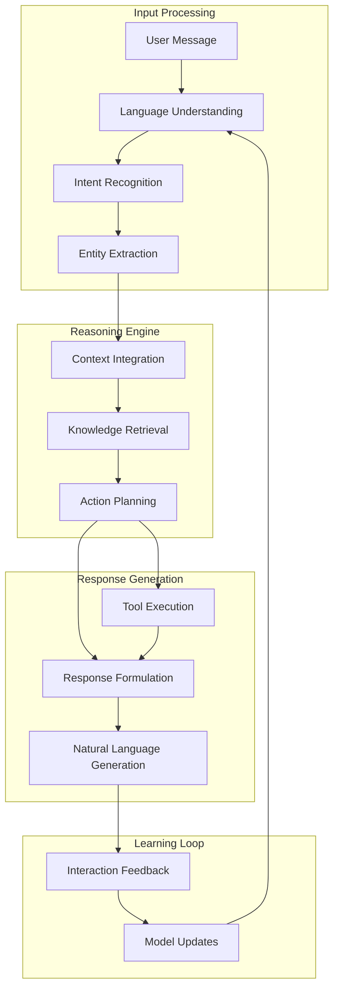

## Defining AI Agents

AI agents are intelligent software systems that can understand, reason, and act on behalf of users through natural conversation. Unlike traditional chatbots that follow scripted responses, AI agents use advanced language models and contextual understanding to provide human-like interactions.

## Core Characteristics

### 🧠 Intelligence & Understanding

- **Natural Language Processing**: Understands intent beyond keywords
- **Context Awareness**: Maintains conversation history and state
- **Reasoning Capabilities**: Makes logical connections and inferences
- **Learning & Adaptation**: Improves performance through interactions

### 🎯 Goal-Oriented Behavior

- **Task Completion**: Works toward specific objectives
- **Multi-Step Planning**: Breaks complex tasks into manageable steps
- **Decision Making**: Chooses appropriate actions based on context
- **Problem Solving**: Finds solutions to user challenges

### 🔗 Integration & Action

- **Tool Usage**: Connects with external systems and APIs
- **Data Access**: Retrieves and processes real-time information
- **Workflow Automation**: Executes complex business processes
- **Real-World Impact**: Creates tangible outcomes and results

## Traditional Chatbots vs AI Agents

<Columns cols={2}>
  <Card title="Traditional Chatbots" icon="robot">
    **Limitations:** - Rule-based decision trees - Keyword matching responses -
    Limited conversation flow - Frequent "I don't understand" responses - Manual
    maintenance and updates - Static knowledge base **Best For:** - Simple FAQ
    scenarios - Linear conversation paths - Predictable user inputs - Limited
    scope applications
  </Card>
  <Card title="AI Agents" icon="brain">
    **Capabilities:** - Contextual understanding - Natural conversation flow -
    Dynamic response generation - Graceful error handling - Continuous learning
    and improvement - Living knowledge ecosystem **Best For:** - Complex
    customer interactions - Multi-faceted problem solving - Personalized
    experiences - Business process automation
  </Card>
</Columns>

## How AI Agents Work

### The Intelligence Stack

### Conversation Lifecycle

1. **Input Analysis**: Process user message for meaning and intent
2. **Context Integration**: Combine with conversation history and user profile
3. **Knowledge Search**: Find relevant information from various sources
4. **Action Planning**: Determine what steps to take to help the user
5. **Tool Execution**: Interact with external systems as needed
6. **Response Generation**: Create natural, helpful responses
7. **Learning**: Update models based on interaction success

## Types of AI Agents

### 🎧 Customer Support Agents

**Purpose**: Automate customer service and support interactions
**Capabilities**:

- Ticket creation and routing
- Knowledge base search and retrieval
- Troubleshooting guidance
- Escalation to human agents
- Multi-language support

**Example Interactions**:

- "I'm having trouble with my account login"
- "Can you help me track my order?"
- "I need to return a product I purchased"

### 💼 Sales & Lead Generation Agents

**Purpose**: Qualify prospects and support sales processes
**Capabilities**:

- Lead qualification and scoring
- Product recommendations
- Appointment scheduling
- CRM integration and data capture
- Sales process automation

**Example Interactions**:

- "I'm interested in your enterprise plan"
- "Can you schedule a demo for next week?"
- "What's the best solution for my company size?"

### 📅 Booking & Scheduling Agents

**Purpose**: Manage appointments and reservations
**Capabilities**:

- Calendar integration and availability checking
- Multi-location scheduling
- Confirmation and reminder systems
- Rescheduling and cancellation handling
- Resource management

**Example Interactions**:

- "I need to book a consultation for tomorrow"
- "Can you reschedule my appointment?"
- "What time slots are available this week?"

### 🛍️ E-commerce Agents

**Purpose**: Enhance shopping experiences and drive conversions
**Capabilities**:

- Product discovery and recommendations
- Order tracking and updates
- Cart abandonment recovery
- Customer account management
- Returns and exchanges

**Example Interactions**:

- "Help me find a gift for my teenager"
- "Where is my order?"
- "I want to return this item"

## Agent Capabilities

### Natural Language Understanding

- **Multi-language Support**: Communicate in 50+ languages
- **Dialect Recognition**: Understand regional variations
- **Slang and Colloquialisms**: Handle informal language
- **Context Preservation**: Maintain meaning across conversation turns

### Memory and Learning

- **Conversation Memory**: Remember context within sessions
- **User Profiles**: Store preferences and interaction history
- **Behavioral Patterns**: Learn from user interactions
- **Continuous Improvement**: Update responses based on feedback

### Integration Powers

- **API Connectivity**: Connect with any REST API
- **Database Access**: Query and update business data
- **Workflow Triggers**: Initiate automated processes
- **Real-time Data**: Access live information and updates

## Benefits of AI Agents

### For Businesses

- **24/7 Availability**: Never miss a customer interaction
- **Scalable Support**: Handle thousands of conversations simultaneously
- **Cost Efficiency**: Reduce operational costs while improving service
- **Data Insights**: Gain valuable customer interaction analytics
- **Brand Consistency**: Maintain uniform communication standards

### For Customers

- **Instant Responses**: Get immediate help without waiting
- **Personalized Service**: Receive tailored assistance and recommendations
- **Convenient Access**: Interact through preferred channels
- **Comprehensive Help**: Access all business information in one place
- **Seamless Experience**: Enjoy smooth, natural conversations

## Implementation Considerations

### When to Use AI Agents

✅ **Ideal Scenarios**:

- High volume, repetitive inquiries
- Complex multi-step processes
- Need for 24/7 availability
- Integration with business systems
- Personalization requirements

❌ **Consider Alternatives When**:

- Highly emotional or sensitive situations
- Legal or compliance-critical interactions
- Complex creative or strategic decisions
- Scenarios requiring human empathy

### Success Factors

1. **Clear Objectives**: Define what success looks like
2. **Quality Knowledge Base**: Provide comprehensive, accurate information
3. **Proper Training**: Test and refine agent responses
4. **User-Centric Design**: Focus on user needs and experience
5. **Continuous Optimization**: Monitor and improve performance

## Getting Started with AI Agents

Ready to build your first AI agent? Choose your path:

<CardGroup cols={2}>
  <Card title="Quick Start Guide" icon="rocket" href="/quickstart">
    Build your first agent in 15 minutes with our step-by-step tutorial
  </Card>
  <Card
    title="Agent Configuration"
    icon="settings"
    href="/ai-agents/agent-configuration/creating-your-agent"
  >
    Learn how to configure and customize your AI agents
  </Card>
  <Card
    title="Use Case Examples"
    icon="lightbulb"
    href="/use-case-examples/customer-support/helpdesk-automation"
  >
    Explore real-world AI agent implementations
  </Card>
  <Card
    title="Technical Deep Dive"
    icon="code"
    href="/ai-technology/understanding-llms"
  >
    Understand the technical foundations of AI agents
  </Card>
</CardGroup>

<Note>
  **New to AI?** AI agents might seem complex, but Tars makes them accessible to
  everyone. Start with our [quickstart tutorial](/quickstart) to see how easy it
  can be to create powerful conversational experiences.
</Note>
