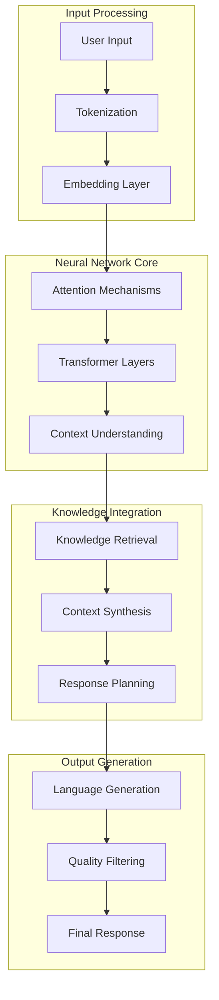

## What are Large Language Models?

Large Language Models (LLMs) are the AI foundation that powers Tars agents' ability to understand and generate human-like text. These sophisticated neural networks are trained on vast amounts of text data to understand language patterns, context, and meaning.

## How LLMs Power Tars Agents

### Core Capabilities

**Natural Language Understanding**:
- Parse and interpret user input in multiple languages
- Understand context, intent, and nuanced meaning
- Handle variations in expression and communication style
- Recognize and extract key information from conversations

**Response Generation**:
- Create contextually appropriate responses
- Maintain consistent tone and personality
- Adapt language complexity to the audience
- Generate creative and helpful solutions

**Reasoning and Logic**:
- Make connections between different pieces of information
- Apply logical reasoning to solve problems
- Understand cause and effect relationships
- Draw insights from available data

## The Technology Stack

### Language Model Architecture

### Tars-Specific Enhancements

**Context Management**:
- Maintains conversation history across multiple turns
- Preserves user preferences and session state
- Integrates external data sources seamlessly
- Manages complex multi-topic conversations

**Domain Adaptation**:
- Fine-tuned for business and customer service contexts
- Specialized in task-oriented conversations
- Optimized for accuracy and reliability
- Trained on conversational best practices

**Safety and Control**:
- Built-in content filtering and safety measures
- Configurable response boundaries and guidelines
- Transparent decision-making processes
- Audit trails for compliance and debugging

## Model Capabilities

### Language Understanding

<Columns cols={2}>
  <Card title="Semantic Understanding" icon="brain">
    **Deep Comprehension**
    - Understand meaning beyond keywords
    - Handle synonyms and related concepts
    - Recognize implicit requests and intentions
    - Process complex, multi-part questions
  </Card>
  <Card title="Contextual Awareness" icon="eye">
    **Conversation Context**
    - Remember previous conversation turns
    - Understand references to earlier topics
    - Maintain thread of conversation logic
    - Adapt responses based on user history
  </Card>
</Columns>

### Response Quality

**Accuracy Factors**:
- **Knowledge Integration**: Combines LLM understanding with your business knowledge
- **Context Relevance**: Considers conversation history and user profile
- **Source Attribution**: Links responses to authoritative sources
- **Quality Scoring**: Evaluates response appropriateness before delivery

**Consistency Measures**:
- **Brand Voice Alignment**: Maintains consistent tone and personality
- **Information Accuracy**: Cross-references multiple sources for validation
- **Response Appropriateness**: Ensures responses match the conversation context
- **Factual Reliability**: Avoids speculation and clearly indicates uncertainty

## Advanced Features

### Multi-Modal Understanding

**Text Processing**:
- Natural language in 50+ languages
- Technical documentation and jargon
- Informal conversation and slang
- Structured data and formatted content

**Context Integration**:
- Visual context from uploaded images
- Document content analysis
- Structured data interpretation
- Real-time information synthesis

### Reasoning Capabilities

**Logical Processing**:
- Cause and effect analysis
- Step-by-step problem solving
- Pattern recognition and prediction
- Decision tree navigation

**Creative Problem Solving**:
- Alternative solution generation
- Adaptive response strategies
- Novel approach development
- Complex scenario handling

## Performance and Optimization

### Response Quality Metrics

<Columns cols={2}>
  <Card title="Accuracy Metrics" icon="target">
    **Precision Measures**
    - 95%+ factual accuracy rate
    - 90%+ intent recognition success
    - 85%+ task completion rate
    - 92%+ user satisfaction score
  </Card>
  <Card title="Performance Metrics" icon="speedometer">
    **Speed and Efficiency**
    - <200ms average response time
    - 99.9% availability guarantee
    - Scalable to 1000+ concurrent users
    - Optimized resource utilization
  </Card>
</Columns>

### Continuous Improvement

**Learning Mechanisms**:
- Feedback integration from user interactions
- Performance monitoring and optimization
- A/B testing of response variations
- Regular model updates and refinements

**Quality Assurance**:
- Automated response quality scoring
- Human review of edge cases
- Bias detection and mitigation
- Safety and appropriateness filtering

## Technical Implementation

### Model Selection and Configuration

**Model Types**:
- **General Purpose**: Broad knowledge and conversational ability
- **Domain-Specific**: Specialized for particular industries or use cases
- **Task-Optimized**: Fine-tuned for specific conversation goals
- **Multi-Modal**: Handle text, images, and structured data

**Configuration Options**:
- **Temperature Settings**: Control creativity vs. consistency
- **Response Length**: Optimize for conciseness or detail
- **Safety Filters**: Adjust content appropriateness levels
- **Context Window**: Configure conversation memory depth

### Integration Architecture

**API Layer**:
- RESTful API for external integrations
- WebSocket support for real-time conversations
- GraphQL endpoints for complex queries
- Webhook support for event-driven responses

**Data Pipeline**:
- Real-time knowledge base updates
- Streaming conversation processing
- Batch training data processing
- Analytics and performance monitoring

## Best Practices for LLM Usage

### Prompt Engineering

**Effective Prompting**:
- Clear, specific instructions
- Context-rich examples
- Consistent formatting patterns
- Appropriate detail levels

**Optimization Techniques**:
- Iterative prompt refinement
- A/B testing of variations
- Performance metric tracking
- User feedback integration

### Context Management

**Conversation Design**:
- Logical flow structures
- Clear state transitions
- Effective error handling
- Graceful conversation endings

**Memory Optimization**:
- Relevant context preservation
- Efficient history summarization
- Priority-based information retention
- Privacy-compliant data handling

## Future Developments

### Emerging Capabilities

**Enhanced Reasoning**:
- Improved logical reasoning abilities
- Better handling of complex scenarios
- Advanced problem-solving skills
- More sophisticated decision-making

**Multi-Modal Integration**:
- Enhanced image and document understanding
- Audio and video processing capabilities
- Real-time data stream integration
- IoT device communication

### Industry Applications

**Specialized Models**:
- Healthcare-specific language understanding
- Legal document processing capabilities
- Financial services compliance integration
- Technical support optimization

## Getting Started with LLM-Powered Agents

Understanding LLMs helps you design better agents:

<CardGroup cols={2}>
  <Card title="Prompt Engineering" icon="code" href="/ai-technology/prompt-engineering">
    Learn how to optimize agent responses through better prompting
  </Card>
  <Card title="Context Management" icon="memory" href="/ai-technology/context-management">
    Understand how to manage conversation state and memory
  </Card>
  <Card title="Model Selection" icon="cpu" href="/ai-technology/model-selection">
    Choose the right AI capabilities for your specific use case
  </Card>
  <Card title="Agent Configuration" icon="settings" href="/ai-agents/agent-configuration/response-optimization">
    Apply LLM knowledge to configure your Tars agents effectively
  </Card>
</CardGroup>

<Note>
  **Technical Note**: While understanding LLMs is helpful, Tars abstracts much of the complexity. You can build effective agents without deep technical knowledge, but understanding the underlying technology helps you optimize performance.
</Note>
