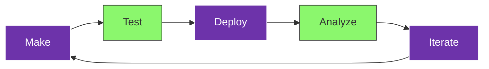

## The Tars Development Lifecycle

Building successful AI agents requires a structured approach that ensures quality, performance, and user satisfaction. The Tars Development Lifecycle is a proven methodology that guides you through every stage of agent creation and optimization.

## The Five-Stage Process

### Make
<Icon icon="hammer" /> **Build and configure your AI agent**
- Design conversation flows using the visual builder
- Configure AI behaviors and personality
- Set up knowledge bases and integrations
- Customize appearance and branding

### Test
<Icon icon="flask" /> **Validate and optimize your agent**
- Run comprehensive testing scenarios
- Optimize conversation flows and responses
- Validate integrations and performance
- Gather feedback from stakeholders

### Deploy
<Icon icon="rocket" /> **Launch your agent to users**
- Choose deployment channels (web, WhatsApp, etc.)
- Configure production settings
- Monitor initial performance
- Ensure smooth user experience

### Analyze
<Icon icon="chart-line" /> **Monitor performance and gather insights**
- Track key performance metrics
- Analyze conversation patterns
- Identify areas for improvement
- Generate actionable reports

### Iterate
<Icon icon="arrows-rotate" /> **Continuously improve your agent**
- Implement optimizations based on data
- Add new features and capabilities
- Refine conversation flows
- Scale for growing user base

## Why This Methodology Works

### Structured Approach
<Icon icon="building" />
- **Predictable Results**: Each stage has clear objectives and deliverables
- **Quality Assurance**: Built-in validation at every step
- **Risk Mitigation**: Issues are caught early in the process
- **Scalable Process**: Works for simple bots to complex enterprise agents

### Continuous Improvement
<Icon icon="trending-up" />
- **Data-Driven Decisions**: Every iteration is based on real performance data
- **User-Centric Design**: Constant feedback loop with actual users
- **Performance Optimization**: Regular tuning for better results
- **Feature Evolution**: Agents grow smarter over time

## Getting Started

### First-Time Builders
<Icon icon="seedling" />
1. **Start Simple**: Begin with basic conversation flows
2. **Learn by Doing**: Use our guided tutorials and templates
3. **Test Early**: Validate concepts before building complexity
4. **Iterate Often**: Make small improvements frequently

### Experienced Teams
<Icon icon="users" />
1. **Plan Architecture**: Design scalable conversation structures
2. **Implement Best Practices**: Follow proven patterns and guidelines
3. **Automate Testing**: Set up comprehensive validation pipelines
4. **Monitor Continuously**: Implement real-time performance tracking

## Success Metrics

<Columns cols={2}>
  <Card title="Development Efficiency" icon="clock">
    **Time to Market**: 60% faster deployment
    **Bug Reduction**: 80% fewer post-launch issues
    **Team Productivity**: 50% more efficient workflows
    **Quality Scores**: 90%+ user satisfaction
  </Card>
  <Card title="Business Impact" icon="trending-up">
    **User Engagement**: 40% higher completion rates
    **Performance**: 3x better response accuracy
    **Scalability**: Handle 10x more conversations
    **ROI**: 300% return on development investment
  </Card>
</Columns>

## Key Principles

### User-First Design
<Icon icon="heart" />
- Start with user needs and pain points
- Design conversations that feel natural
- Optimize for user success, not feature complexity
- Continuously validate with real users

### Data-Driven Development
<Icon icon="chart-bar" />
- Base decisions on performance metrics
- Use A/B testing for optimization
- Track user behavior and satisfaction
- Implement feedback loops

### Iterative Improvement
<Icon icon="refresh" />
- Release early and improve continuously
- Make small, measurable changes
- Learn from each iteration
- Scale what works, fix what doesn't

## Common Pitfalls to Avoid

<Icon icon="x" color="red" /> **Skipping the Testing Phase**: Leads to poor user experiences and emergency fixes

<Icon icon="x" color="red" /> **Over-Engineering**: Adding complexity without user value

<Icon icon="x" color="red" /> **Ignoring Analytics**: Missing opportunities for improvement

<Icon icon="x" color="red" /> **Static Development**: Building once and never iterating

<Icon icon="x" color="red" /> **Siloed Teams**: Not involving stakeholders in the process

## Tools and Resources

### Platform Features
<Icon icon="tools" />
- **Visual Builder**: Drag-and-drop conversation design
- **Testing Suite**: Comprehensive validation tools
- **Analytics Dashboard**: Real-time performance monitoring
- **Deployment Options**: Multiple channel support
- **Optimization Tools**: A/B testing and iteration support

### Documentation and Support
<Icon icon="book-open" />
- **Step-by-Step Guides**: Detailed instructions for each phase
- **Best Practice Examples**: Proven patterns and templates
- **Video Tutorials**: Visual learning resources
- **Community Support**: Connect with other builders
- **Expert Consultation**: Get help from Tars specialists

## Next Steps

Ready to start your development journey? Choose your path:

<CardGroup cols={2}>
  <Card title="Quick Start" icon="rocket" href="/quickstart">
    Jump into building with our 15-minute tutorial
  </Card>
  <Card title="Lifecycle Diagram" icon="sitemap" href="/introduction-to-development/lifecycle-diagram">
    Explore the detailed visual workflow
  </Card>
  <Card title="Stage Breakdown" icon="layers" href="/introduction-to-development/workflow-stages-explained">
    Learn about each development stage in detail
  </Card>
  <Card title="Getting Started Guide" icon="play" href="/introduction-to-development/getting-started-with-workflow">
    Follow our structured approach to your first agent
  </Card>
</CardGroup>

<Note>
  **Pro Tip**: The most successful Tars agents are those that follow this lifecycle religiously. Don't skip stages – each one builds on the previous and contributes to overall success.
</Note>
