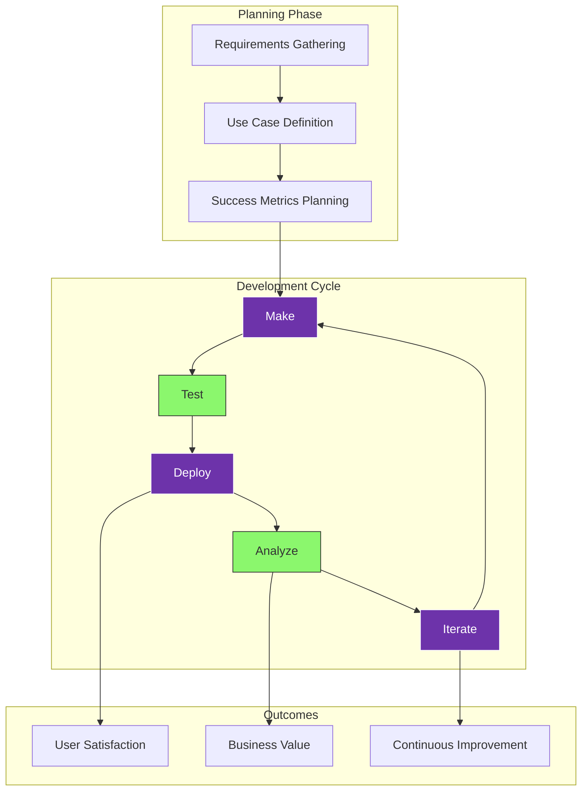
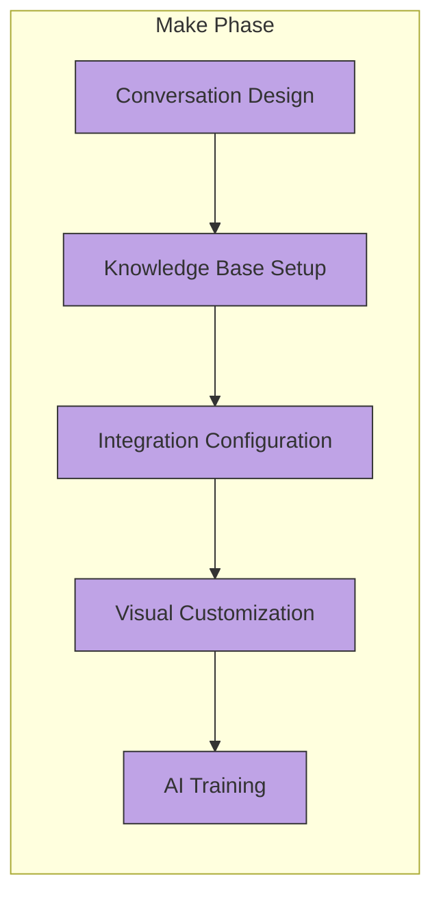
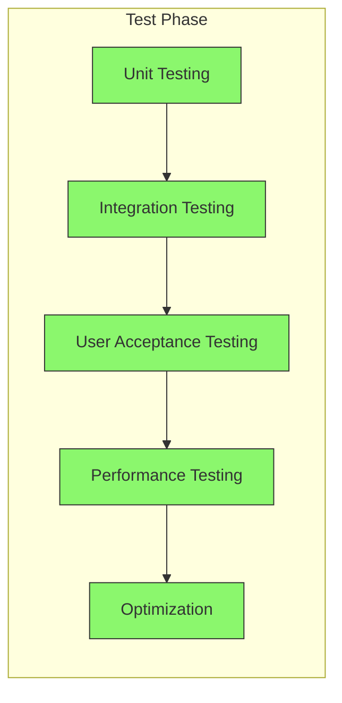
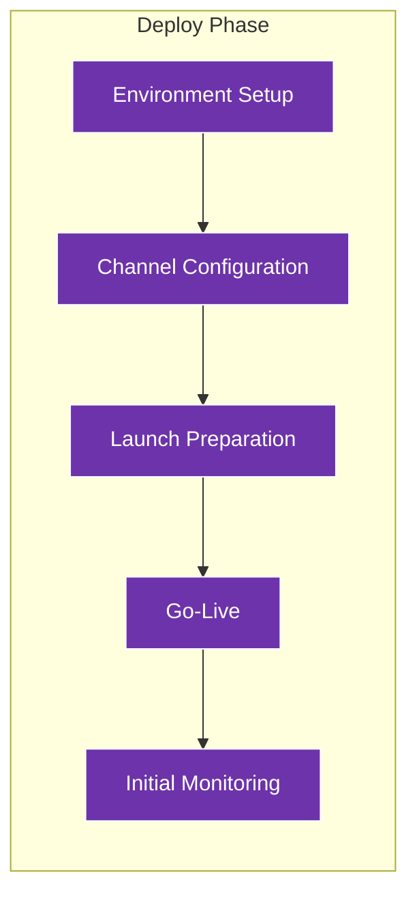
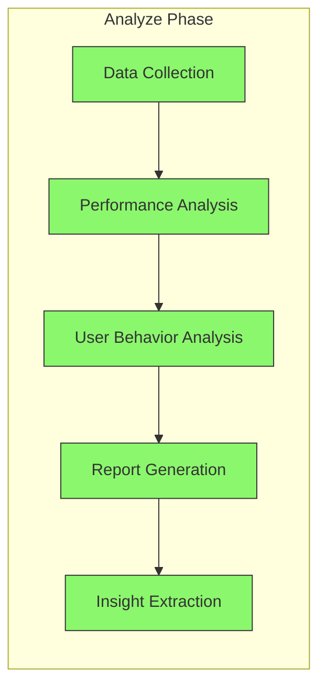
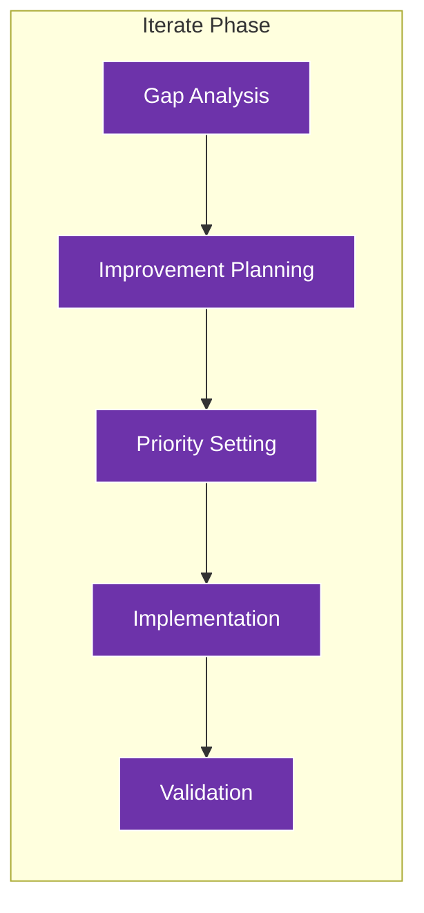
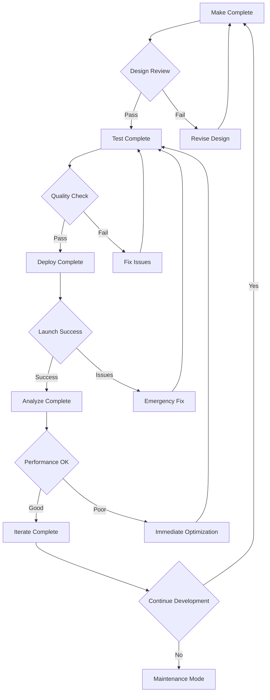

## Complete Development Workflow

The Tars Development Lifecycle is a continuous cycle designed to ensure your AI agents deliver maximum value and performance. Here's the complete visual workflow:

## High-Level Process Flow

## Detailed Stage Breakdown

### Make Stage - Building Your Agent

**Key Activities:**

- Design conversation flows using gambits
- Configure AI personality and behavior
- Set up knowledge bases and content
- Integrate with external tools and systems
- Customize branding and appearance

### Test Stage - Validation & Optimization

**Key Activities:**

- Test individual gambits and flows
- Validate system integrations
- Gather stakeholder feedback
- Measure response times and accuracy
- Optimize based on test results

### Deploy Stage - Going Live

**Key Activities:**

- Set up production environment
- Configure deployment channels
- Execute launch checklist
- Monitor initial performance
- Provide user support

### Analyze Stage - Performance Monitoring

**Key Activities:**

- Collect conversation data and metrics
- Analyze response accuracy and speed
- Study user interaction patterns
- Generate performance reports
- Identify improvement opportunities

### Iterate Stage - Continuous Improvement

**Key Activities:**

- Identify performance gaps
- Plan improvements and new features
- Prioritize changes based on impact
- Implement optimizations
- Validate improvements

## Decision Points and Feedback Loops

### Quality Gates

### Feedback Integration Points

<Columns cols={2}>
  <Card title="Stakeholder Feedback" icon="users">
    **When**: End of Make and Test stages **What**: Design validation, user
    experience review **Impact**: Feature adjustments, flow improvements
    **Timeline**: 1-2 days review cycle
  </Card>
  <Card title="User Feedback" icon="message-circle">
    **When**: Post-deployment, ongoing **What**: Real usage patterns,
    satisfaction scores **Impact**: Major feature decisions, optimization
    priorities **Timeline**: Weekly analysis, monthly planning
  </Card>
</Columns>

## Timeline and Duration

### Typical Development Cycle

| Stage       | Duration  | Key Deliverables                          |
| ----------- | --------- | ----------------------------------------- |
| **Make**    | 1-3 weeks | Functional agent, configured integrations |
| **Test**    | 3-5 days  | Validated flows, performance benchmarks   |
| **Deploy**  | 1-2 days  | Live agent, monitoring setup              |
| **Analyze** | Ongoing   | Performance reports, user insights        |
| **Iterate** | 1-2 weeks | Optimized agent, new features             |

### Factors Affecting Timeline

**Complexity Factors:**

- Number of conversation flows
- Integration requirements
- Custom feature needs
- Team experience level
- Stakeholder availability

**Acceleration Factors:**

- Using proven templates
- Leveraging existing integrations
- Clear requirements definition
- Experienced development team
- Automated testing tools

## Success Patterns

### High-Performing Teams Follow This Pattern:

1. **Short Cycles**: 2-4 week iterations
2. **Early Testing**: Test continuously during Make phase
3. **Data-Driven**: Make decisions based on actual usage
4. **User-Focused**: Prioritize user value over technical features
5. **Collaborative**: Include stakeholders throughout the process

## Tools for Each Stage

<CardGroup cols={3}>
  <Card title="Make Tools" icon="hammer">
    - Visual Flow Builder - Knowledge Base Editor - Integration Configurator -
    Brand Customizer - Preview Mode
  </Card>
  <Card title="Test Tools" icon="flask">
    - Conversation Simulator - Load Testing Suite - A/B Testing Framework -
    Performance Monitor - Feedback Collector
  </Card>
  <Card title="Deploy Tools" icon="rocket">
    - Channel Manager - Environment Controller - Launch Checklist - Monitoring
    Dashboard - Alert System
  </Card>
</CardGroup>

## Next Steps

<CardGroup cols={2}>
  <Card
    title="Detailed Stage Guide"
    icon="layers"
    href="/introduction-to-development/workflow-stages-explained"
  >
    Learn about each stage in comprehensive detail
  </Card>
  <Card
    title="Start Building"
    icon="play"
    href="/introduction-to-development/getting-started-with-workflow"
  >
    Begin your first development cycle with guided steps
  </Card>
  <Card
    title="Make Phase"
    icon="hammer"
    href="/make/builder-interface/canvas-overview"
  >
    Dive into the visual builder and start creating
  </Card>
  <Card
    title="Testing Guide"
    icon="vial"
    href="/test/testing-fundamentals/testing-importance"
  >
    Master the testing methodology for quality agents
  </Card>
</CardGroup>

<Note>
  **Remember**: This is a cycle, not a linear process. The best agents are those
  that go through multiple iterations, getting better with each cycle based on
  real user feedback and performance data.
</Note>
