## Understanding Knowledge Bases

A **Knowledge Base** in Tars is an intelligent information repository that stores and organizes your business content for AI agents to access and use in conversations. Unlike traditional databases that rely on exact matches, Tars knowledge bases use advanced semantic search to understand meaning and context.

## How Knowledge Bases Work

### Vector Database Technology

### The Power of Semantic Understanding

**Traditional Keyword Search**:

- Query: "How to reset password"
- Matches: Documents containing exact words "reset" AND "password"
- Misses: Content about "password recovery", "account restoration", "login issues"

**Tars Semantic Search**:

- Query: "How to reset password"
- Understands: User wants to regain access to their account
- Finds: All related content about password recovery, account reset, login help, security procedures
- Returns: Most relevant and helpful information regardless of exact wording

## Content Sources & Types

### 📄 Document Upload

**Supported Formats**:

- PDF documents
- Microsoft Word (.docx, .doc)
- Plain text files (.txt)
- Markdown files (.md)
- Rich text format (.rtf)

**Best Practices**:

- Use clear, descriptive headings
- Organize content logically
- Include FAQs and common scenarios
- Update documents regularly

### 🌐 Website Scraping

**Automatic Content Import**:

- Crawl entire websites or specific pages
- Extract text content while preserving structure
- Handle dynamic content and JavaScript
- Respect robots.txt and crawling policies

**Configuration Options**:

- Depth levels (how many clicks deep)
- Page filtering by URL patterns
- Content exclusion rules
- Update frequency settings

### 📊 Structured Data

**CSV Files**:

- FAQ pairs (question, answer)
- Product catalogs
- Customer information
- Process documentation

**Database Connections**:

- Real-time data access
- Structured queries
- Automatic synchronization
- Security and access controls

### ✍️ Manual Entry

**Direct Content Creation**:

- FAQ creation interface
- Intent and response pairs
- Context-specific information
- Custom response templates

## Knowledge Processing Pipeline

### 1. Content Ingestion

- **Format Detection**: Identify file types and structures
- **Content Extraction**: Pull text from various formats
- **Quality Validation**: Check for completeness and accuracy
- **Deduplication**: Remove duplicate content

### 2. Text Processing

- **Chunking**: Break content into optimal sizes for processing
- **Cleaning**: Remove formatting artifacts and noise
- **Language Detection**: Identify and handle multiple languages
- **Metadata Extraction**: Capture titles, headings, and structure

### 3. Vector Generation

- **Embedding Creation**: Convert text to mathematical representations
- **Semantic Encoding**: Capture meaning and context
- **Relationship Mapping**: Understand connections between concepts
- **Index Optimization**: Organize for fast retrieval

### 4. Quality Assurance

- **Relevance Testing**: Validate search accuracy
- **Coverage Analysis**: Identify knowledge gaps
- **Performance Monitoring**: Track response quality
- **Continuous Improvement**: Refine based on usage patterns

## Search Performance & Optimization

### Retrieval Accuracy Factors

**Content Quality**:

- Clear, well-written information
- Comprehensive coverage of topics
- Regular updates and maintenance
- Proper formatting and structure

**Query Understanding**:

- Natural language processing
- Intent recognition
- Context preservation
- Multi-turn conversation awareness

**Ranking Algorithm**:

- Semantic similarity scoring
- Recency weighting
- Source credibility
- User interaction feedback

### Performance Metrics

<Columns cols={2}>
  <Card title="Search Accuracy" icon="target">
    **Relevance Score**: 85-95% typical range
    **Answer Quality**: Measured by user satisfaction
    **Coverage Rate**: % of queries that find relevant results
    **Response Time**: < 200ms average retrieval
  </Card>
  <Card title="Knowledge Health" icon="heart-pulse">
    **Content Freshness**: Last update timestamps
    **Gap Analysis**: Topics without sufficient coverage
    **Usage Patterns**: Most/least accessed information
    **Update Frequency**: Content modification tracking
  </Card>
</Columns>

## Integration with AI Agents

### How Agents Use Knowledge

**Query Processing**:

1. User asks a question
2. Agent analyzes intent and context
3. Knowledge base search is performed
4. Relevant information is retrieved
5. AI generates natural response using found content

**Context Preservation**:

- Conversation history influences search
- Previous queries inform current results
- User preferences affect ranking
- Session context provides additional clues

**Multi-Source Synthesis**:

- Combine information from multiple sources
- Reconcile conflicting information
- Provide comprehensive answers
- Attribute sources for transparency

## Best Practices for Knowledge Bases

### Content Strategy

**Organization Principles**:

- Group related topics together
- Use consistent terminology
- Create clear hierarchies
- Include cross-references

**Writing Guidelines**:

- Use conversational language
- Answer questions directly
- Provide examples and context
- Keep information current

**Maintenance Schedule**:

- Regular content audits
- User feedback integration
- Performance monitoring
- Continuous updates

### Optimization Techniques

**Search Enhancement**:

- Include multiple ways to ask the same question
- Use synonyms and related terms
- Provide context for technical terms
- Create topic clusters

**Performance Tuning**:

- Monitor search analytics
- Identify knowledge gaps
- Optimize content based on usage
- A/B test different approaches

## Common Use Cases

### Customer Support Knowledge Base

- Product documentation
- Troubleshooting guides
- FAQ collections
- Policy information
- Contact procedures

### Sales Enablement Knowledge Base

- Product specifications
- Pricing information
- Competitive comparisons
- Case studies
- Objection handling

### Internal Knowledge Base

- Process documentation
- Training materials
- Company policies
- Best practices
- Tool instructions

## Getting Started

Ready to build your Knowledge Base? Follow these steps:

<CardGroup cols={2}>
  <Card
    title="Content Planning"
    icon="map"
    href="/knowledge-bases/knowledge-fundamentals/quality-best-practices"
  >
    Learn how to plan and organize your content for maximum effectiveness
  </Card>
  <Card
    title="Content Ingestion"
    icon="upload"
    href="/knowledge-bases/content-ingestion/website-scraping"
  >
    Discover different ways to import your content into Tars
  </Card>
  <Card
    title="Integration Guide"
    icon="link"
    href="/knowledge-bases/using-with-agents/quick-integration-guide"
  >
    Connect your Knowledge Base to AI agents for intelligent responses
  </Card>
  <Card
    title="Performance Optimization"
    icon="gauge"
    href="/knowledge-bases/search-performance"
  >
    Optimize your Knowledge Base for accuracy and speed

```mermaid
graph TB
    %% User Input
    User[👤 User] --> |"1. Add Knowledge Base"| AddKB["Add Knowledge Base"]
    User --> |"2. Train Knowledge Base"| TrainKB["Train Knowledge Base"]
    
    %% Data Loading Process
    AddKB --> |"Load Data"| DataSources["Data Sources"]
    DataSources --> |"Websites"| WebData["🌐 Web Content"]
    DataSources --> |"Documents"| DocData["📄 PDFs & Files"]
    DataSources --> |"APIs"| APIData["🔌 Confluence, Notion, etc."]
    DataSources --> |"Databases"| DBData["🗄️ CSV, SQL Data"]
    
    %% Content Processing
    WebData --> |"Extract Text"| ContentProcessor["📝 Content Processor"]
    DocData --> ContentProcessor
    APIData --> ContentProcessor
    DBData --> ContentProcessor
    
    ContentProcessor --> |"Save Raw Data"| DataStorage["💾 Data Storage"]
    
    %% Training Process
    TrainKB --> |"Read Data"| DataReader["📖 Read Stored Data"]
    DataReader --> |"Split into Chunks"| TextChunker["✂️ Text Chunking<br/>(Break into pieces)"]
    TextChunker --> |"Create Embeddings"| EmbeddingEngine["🧠 AI Embedding Engine<br/>(Convert text to numbers)"]
    
    %% Vector Storage
    EmbeddingEngine --> |"Store Vectors"| VectorDB1["🗃️ Vector Database 1<br/>(Qdrant)"]
    EmbeddingEngine --> |"Store Vectors"| VectorDB2["🗃️ Vector Database 2<br/>(Weaviate)"]
    
    %% Search Process
    User --> |"Ask Questions"| SearchEngine["🔍 Search Engine"]
    SearchEngine --> |"Find Similar Content"| VectorSearch["🔎 Vector Search"]
    VectorSearch --> |"Get from DB1"| VectorDB1
    VectorSearch --> |"Get from DB2"| VectorDB2
    
    VectorDB1 --> |"Rank Results"| ResultRanker["📊 Result Ranking<br/>(Sort by relevance)"]
    VectorDB2 --> ResultRanker
    ResultRanker --> |"Best Answers"| FinalAnswer["✅ Final Answer"]
    
    %% Status Updates
    AddKB --> |"Progress Updates"| StatusTracker["📈 Status Tracker"]
    TrainKB --> StatusTracker
    StatusTracker --> |"Show Progress"| User
    
    %% Styling
    classDef userClass fill:#e1f5fe,stroke:#01579b,stroke-width:3px
    classDef processClass fill:#fff3e0,stroke:#e65100,stroke-width:2px
    classDef dataClass fill:#e8f5e8,stroke:#1b5e20,stroke-width:2px
    classDef aiClass fill:#fce4ec,stroke:#880e4f,stroke-width:2px
    classDef storageClass fill:#f3e5f5,stroke:#4a148c,stroke-width:2px
    
    class User userClass
    class AddKB,TrainKB,SearchEngine,StatusTracker processClass
    class WebData,DocData,APIData,DBData,ContentProcessor,DataStorage,DataReader,TextChunker dataClass
    class EmbeddingEngine,VectorSearch,ResultRanker aiClass
    class VectorDB1,VectorDB2,FinalAnswer storageClass
```

  </Card>
</CardGroup>

<Note>
  **Quality Tip**: The effectiveness of your AI agent depends heavily on the
  quality and comprehensiveness of your Knowledge Base. Invest time in creating
  clear, accurate, and well-organized content for the best results.
</Note>
