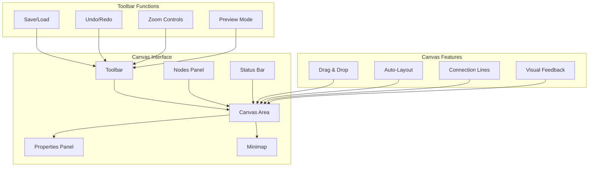

## The Visual Builder Canvas

The Tars canvas is your primary workspace for designing conversation flows. This intuitive, drag-and-drop interface allows you to create sophisticated AI agents without any coding knowledge.

## Canvas Layout

### Main Components



### Interface Elements

<Columns cols={2}>
  <Card title="Canvas Area" icon="vector-square">
    **Main Workspace**
    - Drag and drop gambits
    - Connect conversation flows
    - Visual flow representation
    - Zoom and pan navigation
    - Grid snapping for alignment
  </Card>
  <Card title="Nodes Panel" icon="blocks">
    **Component Library**
    - AI-powered gambits
    - User input components
    - Integration tools
    - Logic and branching
    - Pre-built templates
  </Card>
  <Card title="Properties Panel" icon="settings">
    **Configuration Hub**
    - Gambit-specific settings
    - Response customization
    - Integration parameters
    - Styling options
    - Advanced configurations
  </Card>
  <Card title="Toolbar" icon="wrench">
    **Action Controls**
    - Save and version management
    - Undo/redo functionality
    - Zoom and view controls
    - Preview and testing
    - Collaboration tools
  </Card>
</Columns>

## Navigation & Controls

### Canvas Navigation

**Zoom Controls**:
- **Zoom In/Out**: Mouse wheel or toolbar buttons
- **Fit to Screen**: Auto-resize to see entire flow
- **Zoom to Selection**: Focus on specific gambits
- **1:1 View**: Return to actual size

**Panning**:
- **Mouse Drag**: Click and drag empty canvas space
- **Keyboard**: Arrow keys for precise movement
- **Minimap**: Click to jump to specific areas
- **Scroll Bars**: Traditional navigation method

**Selection**:
- **Single Select**: Click on any gambit
- **Multi-Select**: Ctrl/Cmd + click multiple gambits
- **Box Select**: Drag to select multiple elements
- **Select All**: Ctrl/Cmd + A shortcut

### Keyboard Shortcuts

| Action | Windows/Linux | Mac |
|--------|---------------|-----|
| Save | Ctrl + S | Cmd + S |
| Undo | Ctrl + Z | Cmd + Z |
| Redo | Ctrl + Y | Cmd + Shift + Z |
| Copy | Ctrl + C | Cmd + C |
| Paste | Ctrl + V | Cmd + V |
| Delete | Delete | Delete |
| Select All | Ctrl + A | Cmd + A |
| Zoom In | Ctrl + Plus | Cmd + Plus |
| Zoom Out | Ctrl + Minus | Cmd + Minus |

## Working with Gambits

### Adding Gambits

**From Nodes Panel**:
1. Browse available gambit categories
2. Drag desired gambit to canvas
3. Drop in preferred location
4. Gambit appears with default settings

**Quick Add**:
- Double-click canvas to open quick-add menu
- Type gambit name or description
- Select from filtered results
- Gambit appears at click location

**Templates**:
- Choose from pre-built conversation patterns
- Common flows for different industries
- Best practice implementations
- Customizable starting points

### Connecting Gambits

**Connection Types**:
- **Sequential Flow**: Normal conversation progression
- **Conditional Branch**: Different paths based on conditions
- **Jump Connection**: Skip to specific gambits
- **Loop Back**: Return to previous points in conversation

**Making Connections**:
1. Click on the output port of source gambit
2. Drag to input port of destination gambit
3. Release to create connection
4. Configure conditions if needed

**Connection Styling**:
- **Solid Lines**: Normal flow paths
- **Dashed Lines**: Conditional branches
- **Colored Lines**: Different types of connections
- **Arrow Indicators**: Direction of flow

### Gambit Configuration

**Basic Settings**:
- Gambit name and description
- Input/output configuration
- Timing and delays
- Error handling options

**Advanced Options**:
- Custom logic and conditions
- Integration parameters
- Styling and appearance
- Analytics and tracking

**Response Configuration**:
- Message templates
- Dynamic content insertion
- Personalization options
- Multi-language support

## Visual Flow Design

### Flow Patterns

**Linear Flows**:
```
Start → Question → Process → Response → End
```
- Simple, straight-forward conversations
- Good for basic information gathering
- Easy to understand and maintain
- Limited flexibility

**Branching Flows**:
```
Start → Question → Branch A → Response A
                → Branch B → Response B
                → Branch C → Response C
```
- Multiple conversation paths
- Conditional logic based on responses
- Personalized experiences
- More complex but flexible

**Loop Patterns**:
```
Start → Question → Process → Check → Question (loop)
                            → End (exit)
```
- Repetitive processes
- Data collection scenarios
- Iterative refinement
- Progress tracking

### Design Best Practices

**Layout Organization**:
- **Left-to-Right Flow**: Follow natural reading pattern
- **Vertical Grouping**: Related gambits in columns
- **Clear Spacing**: Avoid overlapping elements
- **Logical Hierarchy**: Important flows more prominent

**Visual Clarity**:
- **Consistent Alignment**: Use grid snapping
- **Color Coding**: Different gambit types
- **Clear Labels**: Descriptive gambit names
- **Connection Organization**: Minimize crossing lines

**Flow Logic**:
- **Single Entry Point**: Clear conversation start
- **Multiple Exit Strategies**: Various conversation endings
- **Error Handling**: Paths for unexpected inputs
- **Fallback Options**: Default responses available

## Canvas Features

### Auto-Layout

**Smart Positioning**:
- Automatic gambit arrangement
- Optimal spacing and alignment
- Minimized connection crossings
- Improved visual clarity

**Layout Algorithms**:
- **Hierarchical**: Top-down organization
- **Circular**: Central hub with branches
- **Grid**: Structured row and column layout
- **Force-Directed**: Natural clustering

### Version Management

**Save States**:
- Manual save points
- Auto-save functionality
- Version timestamps
- Change descriptions

**Version History**:
- View previous versions
- Compare changes
- Restore earlier versions
- Branch from any version

**Collaboration**:
- Multi-user editing
- Change tracking
- Comment system
- Approval workflows

### Preview Integration

**Real-Time Testing**:
- Test conversation flows directly from canvas
- See how changes affect user experience
- Debug connection issues
- Validate gambit configurations

**Preview Modes**:
- **Desktop View**: Standard web interface
- **Mobile View**: Responsive mobile display
- **WhatsApp View**: Messaging platform style
- **Custom View**: Branded appearance

## Advanced Canvas Features

### Custom Themes

**Visual Customization**:
- Canvas background options
- Gambit styling themes
- Connection line styles
- Color scheme selection

**Accessibility**:
- High contrast modes
- Colorblind-friendly palettes
- Keyboard navigation
- Screen reader support

### Performance Optimization

**Large Flow Management**:
- Virtualized rendering for complex flows
- Progressive loading of canvas elements
- Performance monitoring and optimization
- Memory usage optimization

**Collaboration Tools**:
- Real-time collaborative editing
- Conflict resolution
- Change notifications
- Team workspace management

## Getting Started

Ready to start building? Follow these steps:

<CardGroup cols={2}>
  <Card title="Nodes Panel Guide" icon="blocks" href="/make/builder-interface/nodes-panel-guide">
    Learn about available gambits and how to use them effectively
  </Card>
  <Card title="Properties Panel" icon="settings" href="/make/builder-interface/properties-panel">
    Understand how to configure and customize your gambits
  </Card>
  <Card title="Gambits Fundamentals" icon="puzzle-piece" href="/make/gambits-mastery/gambits-fundamentals/what-are-gambits">
    Master the building blocks of conversation design
  </Card>
  <Card title="Flow Design Patterns" icon="sitemap" href="/make/conversation-design/flow-planning">
    Learn proven patterns for effective conversation flows
  </Card>
</CardGroup>

<Note>
  **Pro Tip**: Start with simple, linear flows and gradually add complexity. The canvas auto-layout feature can help organize your flows as they grow more sophisticated.
</Note>
