# Knowledge Base System - Executive Overview

<Info>
This document provides a high-level abstraction of the knowledge base workflow. For detailed technical documentation, see [KNOWLEDGE_BASE_WORKFLOW.md](./KNOWLEDGE_BASE_WORKFLOW.md).
</Info>

## What is the Knowledge Base System?

The Knowledge Base System is an intelligent document processing and retrieval pipeline that transforms unstructured content from various sources (websites, PDFs, Slack, Notion, etc.) into searchable, semantically-indexed knowledge repositories. The system operates in three sequential phases: **Load** (data ingestion), **Index** (embedding generation and storage), and **Retrieve** (semantic search). Content is extracted, chunked into optimal segments, converted into high-dimensional vector embeddings using OpenAI's models, and stored in dual vector databases (Qdrant and Weaviate) for multi-tenant access. When users query the system, it performs semantic similarity search across millions of vectors, retrieves the most relevant document chunks, and uses AI-powered reranking to deliver the top results with contextual accuracy.

---

## System Architecture

```mermaid
graph LR
    subgraph "📥 PHASE 1: LOAD"
        A[Data Sources] -->|Extract| B[Content Parser]
        B -->|Store| C[S3 Storage]
    end
    
    subgraph "🔄 PHASE 2: INDEX"
        C -->|Read| D[Text Chunker]
        D -->|Process| E[OpenAI Embeddings]
        E -->|Store| F[(Vector Databases)]
    end
    
    subgraph "🔍 PHASE 3: RETRIEVE"
        G[User Query] -->|Embed| H[Query Vector]
        H -->|Search| F
        F -->|Results| I[AI Reranking]
        I -->|Top Results| J[Response]
    end
    
    style A fill:#e3f2fd
    style F fill:#f3e5f5
    style J fill:#e8f5e9
```

---

## Workflow Steps

<Steps>

<Step title="Load - Data Ingestion">
The system connects to your data sources (websites, PDFs, Slack channels, Notion pages, etc.) and extracts content using specialized loaders. Raw content is cleaned, structured, and exported to CSV files stored in S3 for persistence.
</Step>

<Step title="Index - Text Chunking">
Documents are split into optimal chunks of 1,000 characters with 50-character overlap using a recursive text splitter. This ensures each chunk maintains context while staying within embedding model limits.
</Step>

<Step title="Index - Embedding Generation">
Each text chunk is processed through OpenAI's embedding model (text-embedding-3-small) to generate 1,536-dimensional vector representations. This happens in batches of 500 chunks for efficiency.
</Step>

<Step title="Index - Vector Storage">
Generated embeddings are uploaded to both Qdrant and Weaviate vector databases with metadata (source URL, tenant ID, document ID). Multi-tenant isolation ensures data privacy across organizations.
</Step>

<Step title="Retrieve - Query Processing">
When a user submits a search query, it's converted into the same 1,536-dimensional vector space using the identical embedding model, enabling semantic similarity comparison.
</Step>

<Step title="Retrieve - Similarity Search">
The query vector is compared against millions of stored vectors using cosine similarity. The system retrieves the top 15-20 most semantically similar document chunks filtered by tenant and knowledge base IDs.
</Step>

<Step title="Retrieve - AI Reranking">
Retrieved chunks are reranked using Cohere's reranking model, which evaluates query-document relevance more deeply than pure vector similarity. The top 4 most relevant results are returned to the user.
</Step>

</Steps>

---

## Key Components

<CardGroup cols={2}>

<Card title="Data Loaders" icon="download">
12+ specialized loaders for websites, PDFs, Slack, Notion, Confluence, Zendesk, SharePoint, and more. Each loader handles source-specific authentication, pagination, and content extraction.
</Card>

<Card title="Vector Databases" icon="database">
Dual storage in Qdrant (high-throughput, payload-based tenancy) and Weaviate (hybrid search, native multi-tenancy). Both databases support millions of vectors with sub-second query times.
</Card>

<Card title="Async Processing" icon="clock">
Celery-based distributed task queue handles long-running operations. Load and index tasks run asynchronously with status tracking via Redis, preventing API timeouts and enabling scalability.
</Card>

<Card title="AI Reranking" icon="stars">
Cohere's reranking model provides semantic relevance scoring beyond vector similarity. This catches nuanced matches that pure cosine distance might miss, improving result quality by 20-30%.
</Card>

</CardGroup>

---

## Technical Highlights

<AccordionGroup>

<Accordion title="Multi-Tenancy & Data Isolation">
Every knowledge base belongs to a tenant (organization/account). Qdrant uses indexed payload filtering, while Weaviate uses native tenant partitions. All queries are automatically scoped to the requesting tenant, ensuring complete data privacy.
</Accordion>

<Accordion title="Batch Processing & Streaming">
The indexing pipeline processes documents in streaming batches of 500 chunks. This prevents memory overflow for large datasets (10K+ documents) while maintaining high throughput (1000+ embeddings/minute with proper API limits).
</Accordion>

<Accordion title="Error Handling & Consistency">
The system implements all-or-nothing semantics. If any batch fails during indexing, all previously uploaded data for that resource is automatically deleted from both vector databases, preventing partial or corrupted knowledge bases.
</Accordion>

<Accordion title="Hybrid Search Capabilities">
Weaviate supports hybrid search combining semantic vector search (neural) with keyword BM25 search (lexical). The alpha parameter controls the blend: 0.75 means 75% semantic + 25% keyword, capturing both conceptual and exact matches.
</Accordion>

</AccordionGroup>

---

## Data Flow Summary

<Tabs>
<Tab title="Input">
**Supported Sources:**
- 🌐 Websites (with Playwright for SPAs)
- 📄 PDF documents
- 💬 Slack conversations
- 📝 Notion pages & databases
- 📚 Confluence wikis
- 🎫 Zendesk articles
- 📁 SharePoint documents
- 📋 CSV, text files, Q&A pairs
</Tab>

<Tab title="Processing">
**Transformation Pipeline:**
1. Content extraction & cleaning
2. Text chunking (1000 chars, 50 overlap)
3. Embedding generation (1536-dim vectors)
4. Metadata attachment (source, tenant, IDs)
5. Dual database storage (Qdrant + Weaviate)
6. Status tracking & error handling
</Tab>

<Tab title="Output">
**Search Results:**
- Top 4 most relevant document chunks
- Source URLs and metadata
- Semantic relevance scores
- Sub-second response times
- Context-aware excerpts
- Multi-source aggregation
</Tab>
</Tabs>

---

## Performance Metrics

<CardGroup cols={3}>

<Card title="Embedding Speed" icon="gauge-high">
**500-1000** chunks/minute  
With OpenAI API rate limits
</Card>

<Card title="Search Latency" icon="bolt">
**<500ms** average  
Vector similarity + reranking
</Card>

<Card title="Storage Efficiency" icon="hard-drive">
**~6KB** per chunk  
1536-dim float32 vectors
</Card>

</CardGroup>

## System Requirements

<Warning>
Ensure all required environment variables are configured before deploying the system.
</Warning>

**Required Services:**
- **OpenAI API** - For embedding generation (text-embedding-3-small)
- **Qdrant Cloud** - Vector storage with tenant isolation
- **Weaviate** - Hybrid search and native multi-tenancy
- **AWS S3** - CSV file storage and data persistence
- **Redis** - Task queue and status tracking
- **Cohere API** - Result reranking for improved relevance

**Infrastructure:**
- Celery workers for async processing
- FastAPI for REST endpoints
- PostgreSQL for dashboard metadata

---

## Monitoring & Observability

<Tip>
All operations are logged with structured logging for easy debugging and monitoring.
</Tip>

**Tracking Capabilities:**
- Real-time task status (PENDING, RUNNING, SUCCESS, FAILURE)
- Per-resource logs stored in S3
- Redis-based progress tracking (visited URLs, failed URLs, processed files)
- Error traces with full context
- Performance metrics for each phase

---

## Security & Compliance

<CardGroup cols={2}>

<Card title="Data Isolation" icon="shield">
Multi-tenant architecture with strict data isolation. Each tenant's vectors are physically separated (Weaviate) or logically filtered (Qdrant) preventing cross-tenant data leakage.
</Card>

<Card title="API Security" icon="lock">
All API endpoints support authentication and authorization. Data resources are scoped to accounts, and retrieval queries are automatically filtered by tenant ID.
</Card>

</CardGroup>

---

## Getting Started

<Steps>

<Step title="Configure Environment">
Set up environment variables for OpenAI, Qdrant, Weaviate, S3, and Cohere. Ensure API keys have appropriate permissions and rate limits.
</Step>

<Step title="Load Your Data">
Choose the appropriate loader for your data source and submit a POST request to `/api/data-resources`. Monitor status via the status endpoint.
</Step>

<Step title="Create Embeddings">
Once loading completes successfully, submit a POST request to `/api/embeddings` to start the indexing process. This typically takes 2-5 minutes per 1000 documents.
</Step>

<Step title="Query Your Knowledge Base">
Use the `/api/v2/retrieve` endpoint with natural language queries. The system returns the most relevant chunks with source attribution and metadata.
</Step>

</Steps>

---

<Info>
For detailed technical specifications, API schemas, and implementation details, refer to [KNOWLEDGE_BASE_WORKFLOW.md](./KNOWLEDGE_BASE_WORKFLOW.md).
</Info>

---

*Last Updated: 2025-10-15*
