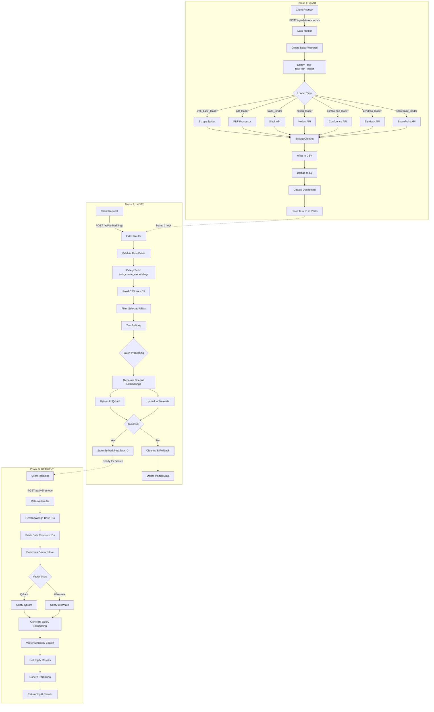
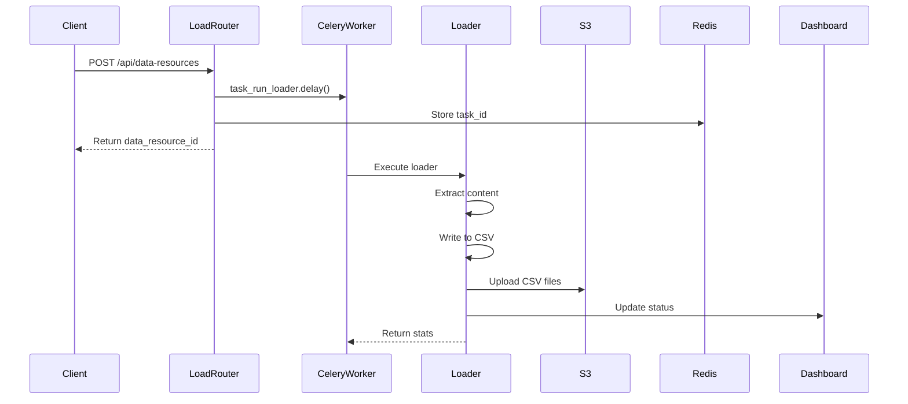
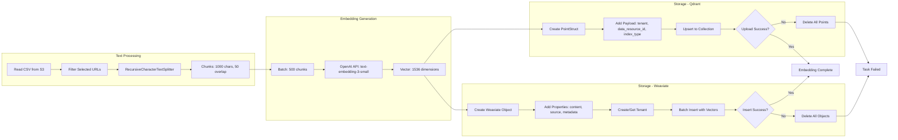
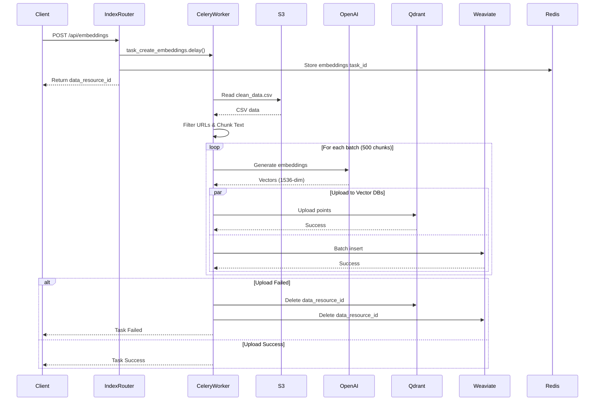
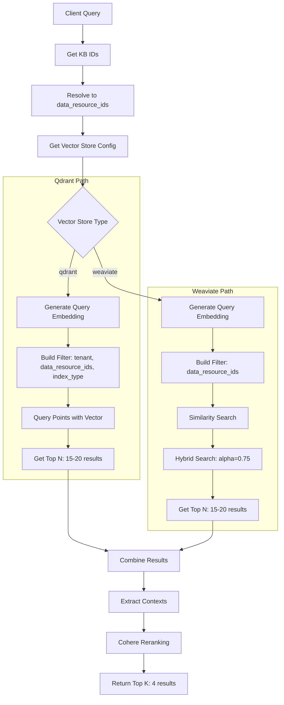
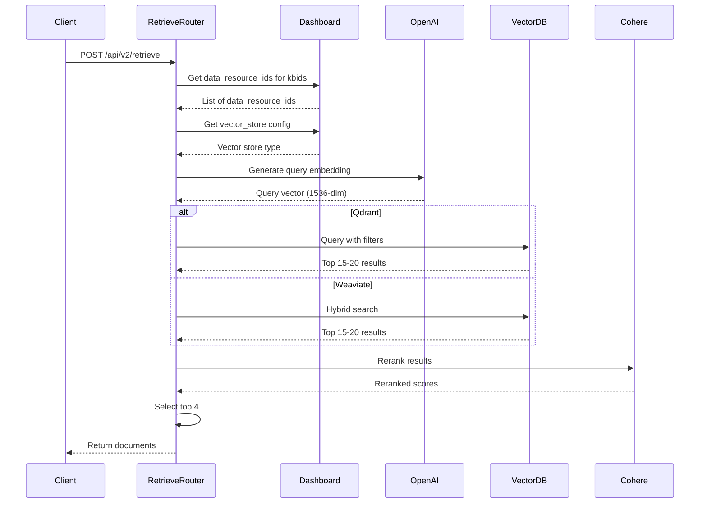
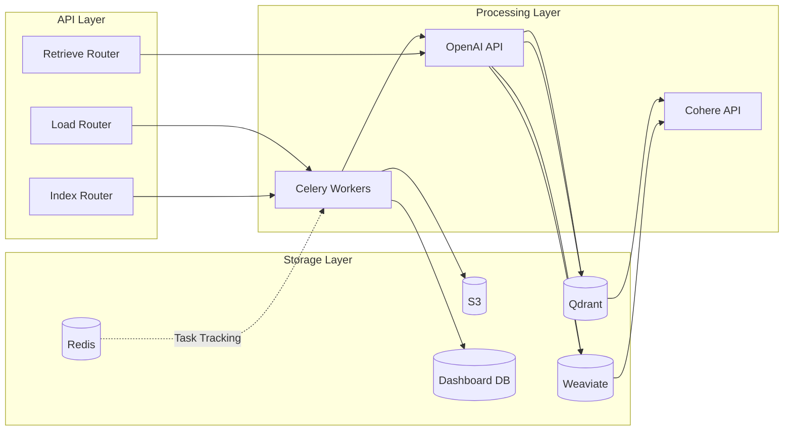
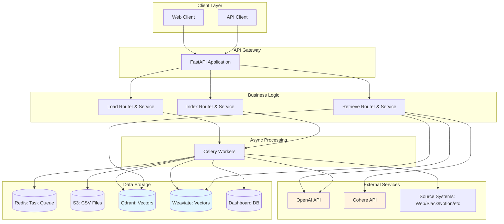

# Knowledge Base System - Complete Workflow

## Overview

The knowledge base system in Asimov follows a three-phase pipeline: **Load → Index → Retrieve**. This document provides a comprehensive overview of how knowledge bases are created, trained (indexed), and queried.

---

## Architecture Components

### Core Modules

- **`knowledge/load/`** - Data ingestion from various sources
- **`knowledge/index/`** - Text chunking and embedding generation
- **`knowledge/retrieve/`** - Similarity search and retrieval
- **`knowledge/datastores/`** - Vector database clients (Qdrant, Weaviate)

### Vector Databases

- **Weaviate** - Primary vector store with hybrid search capabilities
- **Qdrant** - Secondary vector store with multi-tenancy support

---

## Complete Workflow Diagram



---

## Phase 1: Load (Data Ingestion)

### Workflow

1. **API Request**: Client sends `POST /api/data-resources` with loader type and options
2. **Task Creation**: Celery async task `task_run_loader` is created
3. **Data Extraction**: Loader extracts content from source
4. **Storage**: Raw and cleaned data saved to CSV files
5. **S3 Upload**: CSV files uploaded to S3 bucket
6. **Tracking**: Task ID stored in Redis for status monitoring

### Load Phase Sequence Diagram



### Supported Loaders

| Loader Type | Source | Description |
|------------|--------|-------------|
| `web_base_loader` | Websites | Scrapy-based web scraper (Playwright/Sitemap support) |
| `pdf_loader` | PDF Files | Extract text from PDF documents |
| `slack_loader` | Slack | Import Slack messages and threads |
| `notion_loader` | Notion | Import Notion pages and databases |
| `confluence_loader` | Confluence | Import Confluence spaces and pages |
| `zendesk_loader` | Zendesk | Import support articles |
| `sharepoint_loader` | SharePoint | Import SharePoint documents |
| `text_loader` | Text Files | Plain text file import |
| `qna_tuple_loader` | Q&A Pairs | Question-answer pair import |
| `intent_loader` | Intent Data | Intent classification data |
| `csv_to_sql_loader` | CSV | CSV to SQL conversion |
| `openapi_yaml_loader` | OpenAPI | API documentation import |

### Data Structure (CSV Export)

```csv
content,source,metadata
"Document content here...",https://example.com/page1,"{\"title\":\"Page Title\"}"
"More content...",https://example.com/page2,"{\"author\":\"John Doe\"}"
```

---

## Phase 2: Index (Embedding Generation)

### Workflow

1. **API Request**: Client sends `POST /api/embeddings` with data_resource_id
2. **Data Validation**: Check if data resource exists and not already embedded
3. **CSV Reading**: Read exported CSV from S3
4. **URL Filtering**: Filter to selected URLs (if specified)
5. **Text Chunking**: Split documents into chunks (1000 chars, 50 overlap)
6. **Batch Embedding**: Generate OpenAI embeddings in batches (500 chunks)
7. **Upload to Vector DBs**: Store in both Qdrant and Weaviate
8. **Error Handling**: Rollback on failure to maintain consistency

### Index Phase Detailed Flow



### Embedding Process Sequence



### Vector Database Schemas

#### Qdrant Point Structure

```json
{
  "id": "uuid-v4",
  "vector": [0.123, 0.456, ...],  // 1536 dimensions
  "payload": {
    "tenant": "account_id",
    "data_resource_id": "uuid",
    "index_type": "Paragraph",
    "content": "Chunk text content...",
    "source": "https://example.com/page",
    "metadata": {"key": "value"}
  }
}
```

#### Weaviate Object Structure

```json
{
  "class": "Paragraph",
  "properties": {
    "content": "Chunk text content...",
    "source": "https://example.com/page",
    "data_resource_id": "uuid",
    "metadata": {"key": "value"}
  },
  "vector": [0.123, 0.456, ...],  // 1536 dimensions
  "tenant": "account_id"
}
```

### Index Types

| Index Type | Use Case | Schema |
|-----------|----------|--------|
| `Paragraph` | General chunked text | Default 1000 char chunks |
| `Section` | Document sections | Section-level granularity |
| `Website` | Web page level | Full page content |

### Retry & Error Handling

- **Embedding Generation**: 3 retries with exponential backoff (2x, 3-60s)
- **Qdrant Upload**: 5 retries with exponential backoff (1x, 1-10s)
- **Cleanup on Failure**: All-or-nothing semantics - deletes all data on failure

---

## Phase 3: Retrieve (Similarity Search)

### Workflow

1. **API Request**: Client sends `POST /api/v2/retrieve` with query and kbids
2. **KB Resolution**: Fetch data_resource_ids from knowledge base IDs
3. **Vector Store Selection**: Determine which vector DB to use (per tenant)
4. **Query Embedding**: Generate embedding for query text
5. **Vector Search**: Perform similarity search (top_n results, default 15-20)
6. **Reranking**: Use Cohere to rerank results by relevance
7. **Return Results**: Return top_k results (default 4)

### Retrieve Phase Flow



### Retrieve Sequence Diagram



### Search Filters

#### Qdrant Filter Structure

```python
Filter(
    must=[
        FieldCondition(key="tenant", match=MatchValue(value="account_id")),
        FieldCondition(key="index_type", match=MatchAny(any=["Paragraph"])),
        FieldCondition(key="data_resource_id", match=MatchAny(any=["uuid1", "uuid2"]))
    ]
)
```

#### Weaviate Filter Structure

```python
{
    "operator": "And",
    "operands": [
        {
            "path": ["data_resource_id"],
            "operator": "ContainsAny",
            "valueTextArray": ["uuid1", "uuid2"]
        }
    ]
}
```

### Hybrid Search

Weaviate supports hybrid search combining:
- **Vector Search**: Semantic similarity
- **Keyword Search**: BM25 full-text search
- **Alpha Parameter**: Balance between vector (1.0) and keyword (0.0)
  - Default: `alpha=0.75` (75% vector, 25% keyword)

### Reranking Strategy

1. **Initial Retrieval**: Get top 15-20 documents
2. **Context Extraction**: Extract page_content from documents
3. **Cohere Reranking**: Rerank by query relevance
4. **Top K Selection**: Return top 4 most relevant

---

## Data Flow Summary



---

## API Endpoints

### Load APIs

| Endpoint | Method | Description |
|----------|--------|-------------|
| `/api/data-resources` | POST | Create data resource |
| `/api/data-resources/{id}/status` | GET | Check loading status |
| `/api/data-resources/{id}/logs` | GET | Get loader logs |
| `/api/data-resources` | DELETE | Delete data resource |

### Index APIs

| Endpoint | Method | Description |
|----------|--------|-------------|
| `/api/embeddings` | POST | Create embeddings |
| `/api/embeddings/{id}/status` | GET | Check embedding status |

### Retrieve APIs

| Endpoint | Method | Description |
|----------|--------|-------------|
| `/api/v2/retrieve` | POST | Search knowledge base |

---

## Request/Response Examples

### 1. Create Data Resource (Load)

**Request:**
```json
POST /api/data-resources
{
  "data_resource_id": "optional-uuid",
  "account_id": "tenant-123",
  "loader": "web_base_loader",
  "loader_options": {
    "url": "https://example.com",
    "closespider_pagecount": 100,
    "use_browser": false
  }
}
```

**Response:**
```json
{
  "data_resource_id": "uuid-generated"
}
```

### 2. Create Embeddings (Index)

**Request:**
```json
POST /api/embeddings
{
  "data_resource_id": "uuid",
  "account_id": "tenant-123",
  "selected_urls": [
    {"url": "https://example.com/page1"},
    {"url": "https://example.com/page2"}
  ],
  "selected_file_urls": [],
  "vector_store": "weaviate"
}
```

**Response:**
```json
{
  "data_resource_id": "uuid"
}
```

### 3. Retrieve Documents (Search)

**Request:**
```json
POST /api/v2/retrieve
{
  "kbids": ["kb-uuid-1", "kb-uuid-2"],
  "account_id": "tenant-123",
  "query": "How do I configure authentication?",
  "top_k": 4,
  "top_n": 15,
  "alpha": 0.75,
  "hybrid_search": true
}
```

**Response:**
```json
[
  {
    "id": "result-uuid-1",
    "page_content": "To configure authentication...",
    "metadata": {
      "source": "https://example.com/auth-guide",
      "data_resource_id": "uuid"
    }
  },
  {
    "id": "result-uuid-2",
    "page_content": "Authentication setup requires...",
    "metadata": {
      "source": "https://example.com/setup",
      "data_resource_id": "uuid"
    }
  }
]
```

---

## Status Tracking

### Task States

| State | Description |
|-------|-------------|
| `PENDING` | Task queued but not started |
| `RUNNING` | Task is executing |
| `SUCCESS` | Task completed successfully |
| `FAILURE` | Task failed with error |
| `NOT_FOUND` | Task ID not found in Redis |

### Redis Keys

- `data_resource:{uuid}` → Load task ID (TTL: 24h)
- `embeddings:{uuid}` → Embedding task ID (TTL: 24h)
- `visited:{uuid}` → List of successfully crawled URLs
- `failed:{uuid}` → List of failed URLs
- `files:{uuid}` → List of processed files

---

## Multi-Tenancy

### Tenant Isolation

**Qdrant:**
- Uses payload-based filtering with `tenant` field
- Tenant field is indexed for fast filtering
- All queries filtered by tenant ID

**Weaviate:**
- Native multi-tenancy support
- Each tenant has isolated data partition
- Tenants created per collection on first use

### Tenant Configuration

```python
# Weaviate tenant creation
collection.tenants.create(tenants=[Tenant(name=account_id)])

# Qdrant tenant filtering
Filter(must=[
    FieldCondition(key="tenant", match=MatchValue(value=account_id))
])
```

---

## Performance Optimizations

### Batching

- **Embedding Generation**: 500 documents per batch
- **Qdrant Upload**: 500 points per batch
- **Weaviate Upload**: Batch insert with rate limiting

### Retry Logic

- **Transient Failures**: Exponential backoff
- **Rate Limits**: Automatic retry with backoff
- **Timeout Errors**: Configurable retry attempts

### Streaming Pipeline

The indexing process uses a streaming approach:
1. Read batch from S3
2. Generate embeddings
3. Upload to vector DBs
4. Repeat for next batch

This prevents memory overflow for large datasets.

---

## Error Handling & Rollback

### Consistency Guarantees

**All-or-Nothing Semantics:**
- If any batch fails during indexing, all previously uploaded data is deleted
- Ensures no partial/corrupted data in vector stores

### Cleanup Process

```python
try:
    # Upload batches
    embed_documents_in_qdrant(...)
except Exception:
    # Rollback
    qdrant_client.delete(data_resource_id=data_resource_id)
    weaviate_client.delete_data(data_resource_ids=[data_resource_id])
    raise
```

---

## Monitoring & Logging

### Logging Levels

- **DEBUG**: Detailed batch processing info
- **INFO**: High-level operation status
- **ERROR**: Failures and exceptions
- **EXCEPTION**: Full stack traces

### Log Storage

- Logs stored in: `storage/logs/{data_resource_id}.log`
- Accessible via: `GET /api/data-resources/{id}/logs`

---

## Configuration

### Environment Variables

```bash
# OpenAI
OPENAI_API_KEY=sk-...

# Qdrant
QDRANT_URL=https://your-cluster.qdrant.io
QDRANT_API_KEY=your-api-key

# Weaviate
WEAVIATE_URL=https://your-cluster.weaviate.network
WEAVIATE_API_KEY=your-api-key

# AWS S3
AWS_ACCESS_KEY_ID=your-key
AWS_SECRET_ACCESS_KEY=your-secret
S3_BUCKET_NAME=your-bucket

# Cohere
COHERE_API_KEY=your-key

# Dashboard
DASHBOARD_URL=https://dashboard.example.com
```

### Celery Configuration

```python
# Task time limits
soft_time_limit=30  # minutes
time_limit=30       # minutes

# Redis broker
broker_url="redis://localhost:6379/0"
```

---

## Complete System Architecture



---

## Key Takeaways

### Data Pipeline
1. **Load** → Extract content from sources → Store in S3
2. **Index** → Chunk text → Generate embeddings → Store in vector DBs
3. **Retrieve** → Query embedding → Vector search → Rerank → Return results

### Multi-Vector Store Strategy
- **Qdrant**: Fast, efficient, good for high-throughput
- **Weaviate**: Hybrid search, native multi-tenancy
- System supports both with tenant-level configuration

### Scalability Features
- Async processing with Celery
- Batch processing for embeddings
- Streaming pipeline for large datasets
- Multi-tenant isolation

### Reliability Features
- Retry logic with exponential backoff
- All-or-nothing consistency
- Comprehensive error handling
- Status tracking via Redis

---

## Future Enhancements

Potential improvements to consider:

1. **Caching Layer**: Cache frequently accessed embeddings
2. **Incremental Updates**: Update only changed documents
3. **Advanced Chunking**: Context-aware splitting strategies
4. **Multi-Model Support**: Support for different embedding models
5. **Real-time Indexing**: Webhook-based instant indexing
6. **Query Analytics**: Track and optimize common queries
7. **A/B Testing**: Compare different retrieval strategies

---

*Last Updated: 2025-10-15*
