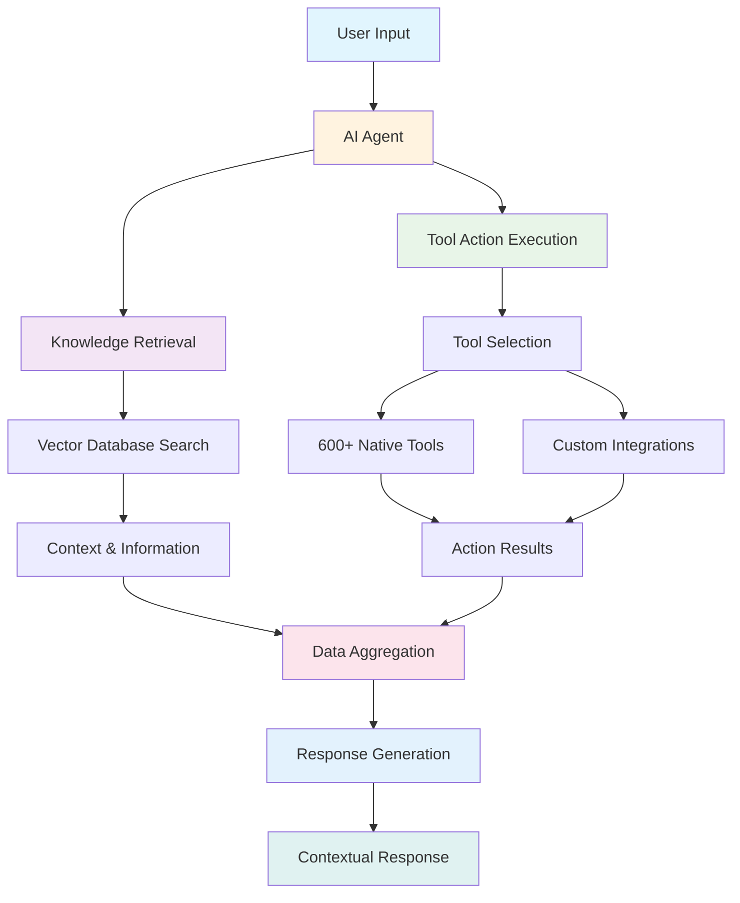
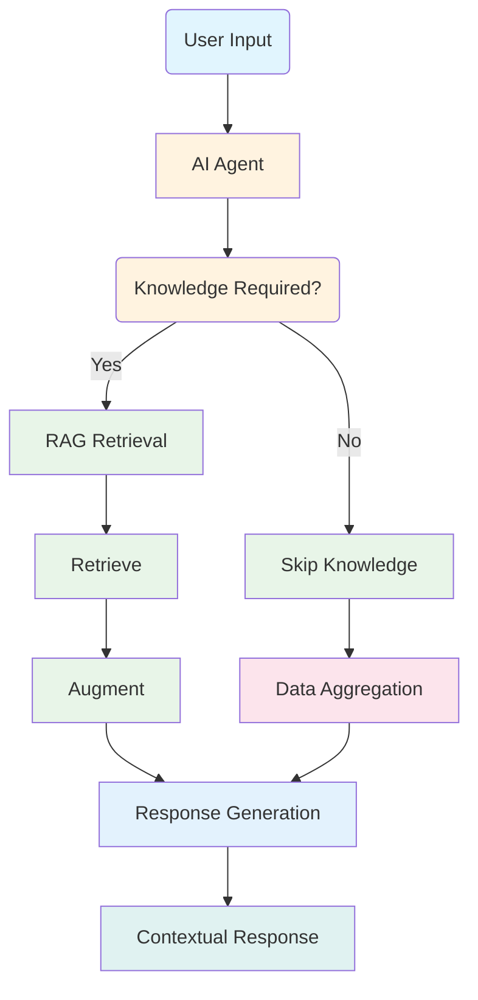

Tars is a **comprehensive conversational AI platform** that enables you to build intelligent agents through a complete development lifecycle. The platform combines AI-powered conversation handling with visual flow building, extensive integrations, and robust analytics to create dynamic conversational experiences that replace static forms and landing pages.
<Frame>

</Frame>

## Core Platform Components

Tars operates through six main components that work together to deliver intelligent conversational experiences:

<CardGroup cols={2}>
  <Card title="AI Agents" icon="robot" >
    - Intelligent Conversation Handlers. Human-like conversation understanding and context awareness.Automatic tool selection and workflow execution
  </Card>
  <Card title="Knowledge Bases" icon="database">
    - Intelligent Information Retrieval
    - Vector-based semantic search using Weaviate and Qdrant
    - Multiple content source support with automatic processing
  </Card>
  
  <Card title="Tools Integration" icon="wrench">
    - External System Connectivity. 600+ pre-built integrations for business platforms
  </Card>

  <Card title="Data Collector" icon="filter">
    - User Query Extraction. Extracts relevant information from user queries
  </Card>

  <Card title="Categorizer" icon="split">
    - Query Categorization. Categorizes user queries into different branches.Facilitates targeted response generation.Improves conversation flow management
  </Card>
  
  <Card title="User-input" icon="pen-field">
    - Flexible Input Collection. Supports diverse input types including text, star ratings, buttons, interactive cards, auto-suggestions, calendar/time selection, file uploads, geolocation, language selection, and auto page redirection.
  </Card>
</CardGroup>

### Agentic workflow

Tars agents handle conversations through sophisticated AI processing where the LMS brain internally manages all processing paths:

### Question Answering Workflow

The Question Answering Workflow uses the same agentic workflow but focuses only on knowledge retrieval:

<Steps>
<Step title="User Input">
  User asks a question or requests information through any interface (web, WhatsApp, direct link).
</Step>

<Step title="Retrieve">
  Performs vector database search using semantic similarity to find relevant
  knowledge from the knowledge base.
</Step>

<Step title="Augment">
  Combines retrieved knowledge with conversation context and user history for
  comprehensive understanding.
</Step>

<Step title="Generate">
  Creates accurate, knowledge-based responses with source attribution and contextual relevance.
</Step>
</Steps>

### Conditional Workflows

**Intelligent Escalation & Routing**

- **Live Chat Handoff**: Seamless transition to human agents when AI cannot resolve queries
- **Custom Workflows**: Conditional logic for complex business processes
- **API Integrations**: Real-time data exchange with external systems

## Knowledge Base Architecture

### Vector Database Technology

<CardGroup cols={2}>
  <Card
    title="Knowledge Bases"
    icon="database"
  >
    ***Semantic Search Technology*** enables content ingestion from multiple sources, utilizes vector embeddings for meaning-based search, provides context-aware retrieval and ranking, and offers real-time knowledge access.
  </Card>

  <Card
    title="Vector Databases"
    icon="server"
  >
    ***Weaviate & Qdrant Integration*** involves mathematical content representations, fast semantic search capabilities, scalable storage and retrieval, and performance optimization.
  </Card>
</CardGroup>

### Knowledge Processing Workflow

<Steps>
<Step title="Data Import">
  Content ingestion from websites, documents, APIs, and manual entry with automatic cleaning and formatting.
</Step>

<Step title="Indexing & Embedding">
  Content conversion to searchable vector embeddings that capture semantic
  meaning and relationships.
</Step>

<Step title="Vector Database Storage">
  Processed embeddings stored in Weaviate and Qdrant for fast, scalable semantic
  search.
</Step>

<Step title="Semantic Search">
  Real-time retrieval of relevant content based on conversation context and user
  intent.
</Step>

<Step title="Contextual Response">
  Integration of retrieved knowledge into natural agent responses with source attribution.
</Step>
</Steps>

## Integration Framework

### Platform Integration Types

<CardGroup cols={2}>
  <Card
    title="Pre-Built Tools (600+)"
    icon="plug"
  >
    **Native Platform Integrations** Connect CRM, productivity, and communication platforms with one-click setup and guided configuration, support multiple actions per platform, and include automatic updates and maintenance.
  </Card>

  <Card
    title="Custom & 3rd Party"
    icon="code"
  >
    **API Integrations** 
    - Provide REST API support for any system, secure credential storage for API keys and OAuth, custom data transformation and mapping.
  </Card>
</CardGroup>

## Multi-Platform Deployment

### Channel Flexibility

**Website Integration**

- Embeddable chat widgets with full customization
- Custom domain hosting for professional deployment
- Cross-browser compatibility and mobile responsiveness

**WhatsApp Business Platform**

- Native WhatsApp Business API integration
- Rich media messaging and broadcast capabilities
- Business number setup and verification

**Direct Access**

- Shareable agent links for campaigns and social media
- QR code generation for offline-to-online engagement
- Custom branding and analytics tracking

## Security & Compliance

**Enterprise-Grade Protection**

- End-to-end encryption for all communications
- SOC 2 Type II certified security controls
- GDPR and CCPA compliant data processing
- Role-based access control with audit logging

## Next Steps

<CardGroup cols={2}>
  <Card
    title="Key Concepts"
    icon="lightbulb"
    href="/platform-fundamentals/key-concepts"
  >
    Master essential terminology and platform relationships
  </Card>

  <Card title="Start Building" icon="rocket" href="/">
    Create your first agent with our step-by-step tutorial
  </Card>
</CardGroup>

<Note>
  **Want technical details?** Visit our [Technical Deep
  Dive](/ai-technology/understanding-llms) section for in-depth information
  about AI models, vector embeddings, and system architecture.
</Note>
