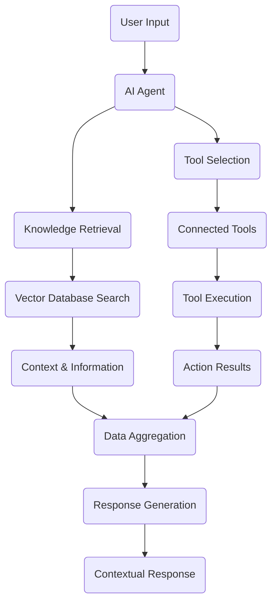
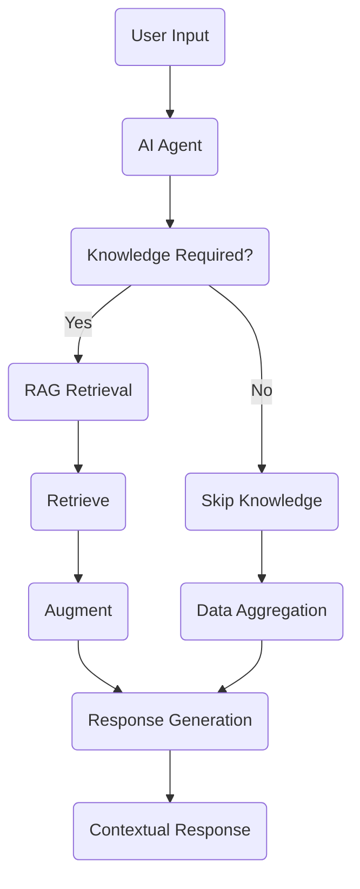

<Frame>

</Frame>

## Core platform components

Tars operates through six main components that work together to deliver intelligent conversational experiences:

<CardGroup cols={2}>
  <Card title="AI Agents" icon="robot" >
    - Intelligent Conversation Handlers. Human-like conversation understanding and context awareness.Automatic tool selection and workflow execution
  </Card>
  <Card title="Knowledge Bases" icon="database">
    - Intelligent Information Retrieval
    - Vector-based semantic search using Weaviate and Qdrant
    - Multiple content source support with automatic processing
  </Card>
  
  <Card title="Tools Integration" icon="wrench">
    - External System Connectivity. 600+ pre-built integrations for business platforms
  </Card>

  <Card title="Data Collector" icon="filter">
    - User Query Extraction. Extracts relevant information from user queries
  </Card>

  <Card title="Categorizer" icon="split">
    - Query Categorization. Categorizes user queries into different branches.Facilitates targeted response generation.Improves conversation flow management
  </Card>
  
  <Card title="User-input" icon="pen-field">
    - Flexible Input Collection. Supports diverse input types including text, star ratings, buttons, interactive cards, auto-suggestions, calendar/time selection, file uploads, geolocation, language selection, and auto page redirection.
  </Card>
</CardGroup>

### Agentic workflow

Tars agents handle conversations through sophisticated AI processing where the LMS brain internally manages all processing paths:

### Question Answering workflow

The Question Answering Workflow uses the same agentic workflow but focuses only on knowledge retrieval:

<Steps>
<Step title="User input">
  User asks a question or requests information through any interface (web, WhatsApp, direct link).
</Step>

<Step title="Retrieve">
  Performs vector database search using semantic similarity to find relevant
  knowledge from the Knowledge Base.
</Step>

<Step title="Augment">
  Combines retrieved knowledge with conversation context and user history for
  comprehensive understanding.
</Step>

<Step title="Generate">
  Creates accurate, knowledge-based responses with source attribution and contextual relevance.
</Step>
</Steps>

## How does the Knowledge Base work?

The Knowledge Base System transforms unstructured content from various sources into intelligent, searchable knowledge that your **AI Agent** can access instantly.

The system operates in three phases: `Load`-> `Index`-> `Retrieve`.
<Frame>

</Frame>

  <Card
    title="Load Phase"
    icon="download"
  >
    ***Data Ingestion*** Connect to 12+ data sources including websites, PDFs, Slack, Notion, Confluence, and more. Content is extracted, cleaned, and stored for processing.
  </Card>
<CardGroup cols={2}>

  <Card
    title="Index Phase"
    icon="layer-group"
  >
    ***Embedding Creation*** Documents are split into optimal chunks and converted into vector embeddings using OpenAI's models, then stored in dual vector databases (Qdrant & Weaviate).
  </Card>

  <Card
    title="Retrieve Phase"
    icon="magnifying-glass"
  >
    ***Semantic Search*** User queries are converted to vectors and matched against stored embeddings. AI-powered reranking returns the top 4 most relevant results in under 500ms.
  </Card>
</CardGroup>

### Knowledge processing workflow

<Steps>
<Step title="Content ingestion">
  Your data sources (websites, PDFs, Slack channels, Notion pages, etc.) are connected and content is extracted using specialized loaders. Raw content is cleaned and prepared for processing.
</Step>

<Step title="Text chunking & embedding">
  Documents are split into 1,000-character chunks with overlap to maintain context. Each chunk is converted into a 1,536-dimensional vector using OpenAI's embedding model, capturing semantic meaning.
</Step>

<Step title="Vector storage">
  Generated embeddings are stored in both **Qdrant** and **Weaviate** vector databases with metadata (source URL, document ID). Multi-tenant isolation ensures your data remains private and secure.
</Step>

<Step title="Query processing">
  When users ask questions, queries are converted into the same vector format and compared against millions of stored vectors using semantic similarity search.
</Step>

<Step title="AI reranking & response">
  Retrieved chunks are reranked using Cohere's AI model to evaluate relevance. The top 4 results are returned with source attribution, enabling your Agent to provide accurate, contextual answers.
</Step>
</Steps>

<Note>
  **Fast & scalable:** The system processes 500-1,000 chunks per minute during indexing and delivers search results in under 500ms, supporting millions of vectors across multiple knowledge bases.
</Note>

## How tool execution works?

Tool execution at Tars is managed through a configured **AI Agent**, which interacts with connected external systems securely and intelligently. The architecture ensures that all actions, authentications, and data exchanges happen entirely within backend systems, keeping credentials and sensitive information fully protected.

### Tool execution architecture
<Frame>

</Frame>

The tool execution system is built on three key principles:

  <Card
    title="Backend-Only Execution"
    icon="server"
  >
    ***Secure Processing*** All tool interactions and processing occur exclusively within backend systems. Tool credentials remain encrypted in backend databases and are never exposed to frontend clients.
  </Card>
<CardGroup cols={2}>
  <Card
    title="AI-Driven Intelligence"
    icon="brain"
  >
    ***Smart Tool Selection*** The AI Agent automatically determines which tools to use based on user intent and connected tool capabilities, executing actions within the LangGraph workflow.
  </Card>
  <Card
    title="Encrypted Communication"
    icon="shield-halved"
  >
    ***End-to-End Security*** Every payload transmitted between services is encrypted, and the AI Agent can only execute tools that are explicitly connected and authorized.
  </Card>
</CardGroup>

### Tool execution workflow

<Steps>
<Step title="User interaction">
  The user interacts with the **CX Agent** interface, submitting queries or requests that may require tool execution.
</Step>

<Step title="Backend parsing & payload preparation">
  The **Chatbot Backend** receives the user input, parses it, and prepares a structured payload. All sensitive data within the payload is securely encrypted before being sent to the **AI Service Backend**.
</Step>

<Step title="AI Agent execution">
  Inside the **AI Service Backend**, the configured AI Agent processes the request. If the agent has connected tools, it executes the appropriate tool action within the **LangGraph workflow**. If no tools are connected, the agent continues reasoning and generates a response without performing any tool action.
</Step>

<Step title="Response handling">
  The **AI Service Backend** processes the tool output (if any) and formulates the final agent response. This response is securely returned to the **Chatbot Backend**, which parses and extracts only the necessary information for display.
</Step>

<Step title="User display">
  The processed response is sent to the **CX Agent** interface, where it's shown to the user. Throughout the flow, raw credentials or sensitive data are never exposed.
</Step>
</Steps>

<Note>
  **Security first:** Tool execution at Tars is secure, backend-driven, and fully agent-controlled. Each execution is logged for transparency, monitoring, and governance, ensuring that sensitive data never leaves trusted backend environments.
</Note>

## How does WhatsApp integration work?

TARS enables businesses to deploy **AI Agents** on WhatsApp through a seamless integration architecture. The system abstracts provider differences, normalizes message formats, and ensures reliable, sequential message delivery while maintaining conversation context and state.

### WhatsApp integration architecture

The integration is built on **three key abstraction layers** that work together to deliver AI-powered conversations on WhatsApp:

<Frame>

</Frame>
  <Card
    title="360Dialog Provider"
    icon="plug"
  >
    ***WhatsApp API Integration*** Receives webhooks from WhatsApp Business API and delivers messages back to users.
  </Card>

<CardGroup cols={2}>

  <Card
    title="Tars Chatbot Backend"
    icon="server"
  >
    ***Message Orchestration*** Handles API routing, validation, credit checking, message transformation (inbound/outbound), conversation engine processing, and response delivery.
  </Card>

  <Card
    title="AI Service"
    icon="brain"
  >
    ***AI Agent Processing*** Handles AI Agent dependent requests from the Chatbot Backend, processes with AI logic, and returns intelligent responses.
  </Card>
</CardGroup>

### WhatsApp integration workflow

<Steps>
<Step title="Webhook reception">
  A user sends a message via WhatsApp. The message is received by **360Dialog** and forwarded to the **Tars Chatbot Backend** via webhook.
</Step>

<Step title="Validation & transformation">
  The **Tars Chatbot Backend** validates credentials, checks credits, and transforms the WhatsApp message into Tars internal format.
</Step>

<Step title="Conversation processing">
  The **Conversation Engine** (within Chatbot backend) processes the message, executes action functions, and determines the next gambit. If AI Agent processing is needed, the request is sent to the **AI Service**.
</Step>

<Step title="AI processing (if needed)">
  The **AI Service** handles AI Agent dependent requests, processes with AI logic, and returns the intelligent response back to the **Tars Chatbot Backend**.
</Step>

<Step title="Response transformation & delivery">
  The **Tars Chatbot Backend** transforms the response into WhatsApp-compatible format (including buttons, lists, media), queues it in **Redis** for sequential delivery, updates conversation state in **MongoDB**, and sends it to the user via **360Dialog** and WhatsApp.
</Step>
</Steps>

<Note>
  **Seamless integration:** The system supports multi-turn conversations, media handling, interactive elements, live chat handover, and automatic error handling with retry logic.
</Note>

## How does Livechat work?

Tars provides a standalone Livechat feature that enables direct conversations between users and human agents. The platform includes a **native Livechat dashboard** where human agents can manage and respond to conversations in real-time.
<Frame>

</Frame>

### Livechat components

  <Card
    title="AI Agent Interface"
    icon="user"
    horizontal
  >
    Users interact through the AI Agent interface. Messages flow to the Chatbot backend for processing.
  </Card>
<CardGroup cols={2}>

  <Card
    title="Tars Chatbot Backend"
    icon="server"
  >
     When a Livechat Gambit is triggered, the backend coordinates the handoff to the Livechat Server and handles session management.
  </Card>

  <Card
    title="Livechat Server"
    icon="comments"
  >
    Creates livechat sessions, notifies agents via the Admin Dashboard, and routes messages between users and human agents.
  </Card>
</CardGroup>

  <Card
    title="Admin Dashboard"
    icon="desktop"
    horizontal
  >
    Human agents receive notifications, view conversations, and respond to users in real-time through the native dashboard.
  </Card>

### Livechat workflow

<Steps>
<Step title="User message">
  A user sends a message through the **AI Agent Interface**, which forwards it to the **Tars Chatbot Backend** for processing.
</Step>

<Step title="Livechat Gambit triggered">
  When the conversation reaches a **Livechat Gambit**, the **Tars Chatbot Backend** triggers the handoff process and sends the conversation to the **Livechat Server**.
</Step>

<Step title="Session creation & agent notification">
  The **Livechat Server** creates a new livechat session and notifies human agents through the **Admin Dashboard**.
</Step>

<Step title="Human agent response">
  Human agents view the conversation in the **Admin Dashboard** and respond. The response flows back through the **Livechat Server** to the **AI Agent Interface**.
</Step>

<Step title="Response delivery">
  The **AI Agent Interface** displays the human agent's response to the user. The conversation continues with real-time message exchange between user and agent.
</Step>

<Step title="Session end">
  When the conversation is resolved, the human agent can end the session from the **Admin Dashboard**, returning control to the automated flow.
</Step>
</Steps>

<Note>
  **Standalone capability:** Livechat operates independently from AI Agent flows. You can build conversation paths that lead directly to human agents using the Livechat Gambit, or keep it completely separate from automated workflows.
</Note>

## Multi-platform deployment

Tars Agents can be deployed across multiple channels including websites, WhatsApp Business, and direct shareable links—ensuring your users can engage wherever they are. [Learn how to distribute your AI Agent &rarr;](/build-agent#distribute-your-ai-agent)
