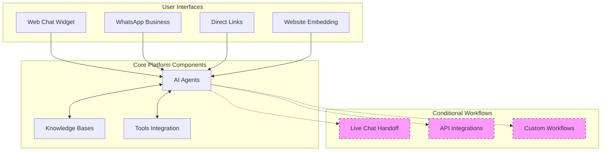
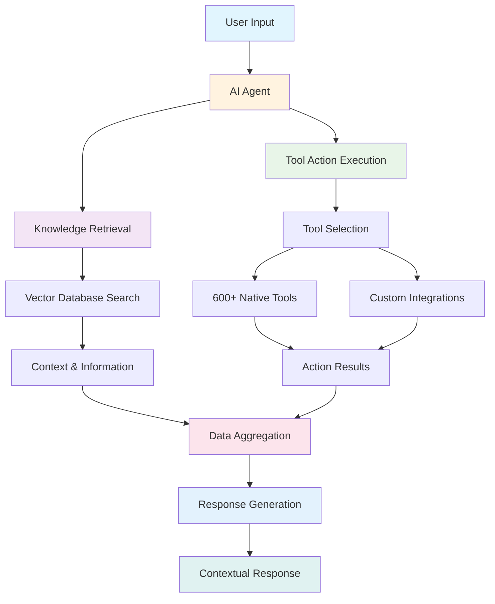
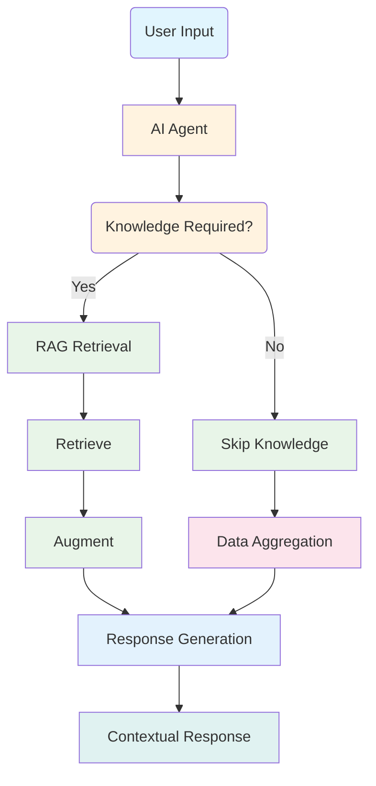

Tars is a **comprehensive conversational AI platform** that enables you to build intelligent agents through a complete development lifecycle. The platform combines AI-powered conversation handling with visual flow building, extensive integrations, and robust analytics to create dynamic conversational experiences that replace static forms and landing pages.

## Core Platform Components

Tars operates through six main components that work together to deliver intelligent conversational experiences:

<CardGroup cols={2}>
  <Card title="AI Agents" icon="robot" href="/ai-agents/understanding-ai-agents/what-are-ai-agents">
    **Intelligent Conversation Handlers**
    - Human-like conversation understanding and context awareness
    - Natural language processing with personality customization
    - Multi-turn conversation management with memory
    - Automatic tool selection and workflow execution
  </Card>

{" "}
<Card title="Data Collector" icon="filter" href="/data-collector/overview">
  **User Query Extraction** - Extracts relevant information from user queries -
  Enhances understanding of user intent - Supports dynamic conversation routing
</Card>

  <Card title="Categorizer" icon="split" href="/categorizer/overview">
    **Query Categorization**
    - Categorizes user queries into different branches
    - Facilitates targeted response generation
    - Improves conversation flow management
  </Card>
  
  <Card title="Knowledge Bases" icon="database" href="/knowledge-bases/knowledge-fundamentals/what-are-knowledge-bases">
    **Intelligent Information Retrieval**
    - Vector-based semantic search using Weaviate and Qdrant
    - Multiple content source support with automatic processing
    - Context-aware answer generation with source attribution
    - Real-time content updates and optimization
  </Card>
  
  <Card title="Tools Integration" icon="wrench" href="/tools-integration/tools-fundamentals/what-are-tools">
    **External System Connectivity**
    - 600+ pre-built integrations for business platforms
    - Custom API connections with secure authentication
    - Real-time data synchronization and workflow automation
    - Enterprise-grade security and compliance
  </Card>
    <Card title="User-input" icon="pen-field" href="/user-input/overview">
    **User-input**
    - Handles user input for different types of input
  </Card>
</CardGroup>

### Agentic workflow

Tars agents handle conversations through sophisticated AI processing where the LMS brain internally manages all processing paths:

### Question Answering Workflow

The Question Answering Workflow uses the same agentic workflow but focuses only on knowledge retrieval:

<Steps>
<Step title="User Input">
  User asks a question or requests information through any interface (web, WhatsApp, direct link).
</Step>

<Step title="Retrieve">
  Performs vector database search using semantic similarity to find relevant
  knowledge from the knowledge base.
</Step>

<Step title="Augment">
  Combines retrieved knowledge with conversation context and user history for
  comprehensive understanding.
</Step>

<Step title="Generate">
  Creates accurate, knowledge-based responses with source attribution and contextual relevance.
</Step>
</Steps>

### Conditional Workflows

**Intelligent Escalation & Routing**

- **Live Chat Handoff**: Seamless transition to human agents when AI cannot resolve queries
- **Custom Workflows**: Conditional logic for complex business processes
- **API Integrations**: Real-time data exchange with external systems

## Knowledge Base Architecture

### Vector Database Technology

<CardGroup cols={2}>
  <Card
    title="Knowledge Bases"
    icon="database"
    href="/knowledge-bases/knowledge-fundamentals/what-are-knowledge-bases"
  >
    **Semantic Search Technology** - Content ingestion from multiple sources -
    Vector embeddings for meaning-based search - Context-aware retrieval and
    ranking - Real-time knowledge access
  </Card>

  <Card
    title="Vector Databases"
    icon="server"
    href="/ai-technology/understanding-llms"
  >
    **Weaviate & Qdrant Integration** - Mathematical content representations -
    Fast semantic search capabilities - Scalable storage and retrieval -
    Performance optimization
  </Card>
</CardGroup>

### Knowledge Processing Workflow

<Steps>
<Step title="Data Import">
  Content ingestion from websites, documents, APIs, and manual entry with automatic cleaning and formatting.
</Step>

<Step title="Indexing & Embedding">
  Content conversion to searchable vector embeddings that capture semantic
  meaning and relationships.
</Step>

<Step title="Vector Database Storage">
  Processed embeddings stored in Weaviate and Qdrant for fast, scalable semantic
  search.
</Step>

<Step title="Semantic Search">
  Real-time retrieval of relevant content based on conversation context and user
  intent.
</Step>

<Step title="Contextual Response">
  Integration of retrieved knowledge into natural agent responses with source attribution.
</Step>
</Steps>

## Integration Framework

### Platform Integration Types

<CardGroup cols={2}>
  <Card
    title="Pre-Built Tools (600+)"
    icon="plug"
    href="/tools-integration/tools-fundamentals/available-tools-gallery"
  >
    **Native Platform Integrations** - CRM, productivity, and communication
    platforms - One-click setup with guided configuration - Multiple actions per
    platform - Automatic updates and maintenance
  </Card>

  <Card
    title="Custom & 3rd Party"
    icon="code"
    href="/tools-integration/individual-tools/api-gambit/api-configuration"
  >
    **API Integrations** - REST API support for any system - Secure credential
    storage (API keys, OAuth) - Custom data transformation and mapping - Webhook
    support for real-time updates
  </Card>
</CardGroup>

## Multi-Platform Deployment

### Channel Flexibility

**Website Integration**

- Embeddable chat widgets with full customization
- Custom domain hosting for professional deployment
- Cross-browser compatibility and mobile responsiveness

**WhatsApp Business Platform**

- Native WhatsApp Business API integration
- Rich media messaging and broadcast capabilities
- Business number setup and verification

**Direct Access**

- Shareable agent links for campaigns and social media
- QR code generation for offline-to-online engagement
- Custom branding and analytics tracking

## Platform Architecture

### Performance & Scalability

**Infrastructure Design**

- Auto-scaling for traffic spikes and high volume
- Global CDN deployment for worldwide low latency
- 99.9% uptime SLA with automatic failover
- Real-time monitoring and performance alerts

**Response Optimization**

- < 200ms for simple conversations
- < 1 second for knowledge base searches
- < 3 seconds for complex integrations
- Intelligent caching and performance tuning

### Security & Compliance

**Enterprise-Grade Protection**

- End-to-end encryption for all communications
- SOC 2 Type II certified security controls
- GDPR and CCPA compliant data processing
- Role-based access control with audit logging

## Next Steps

<CardGroup cols={2}>
  <Card
    title="Key Concepts"
    icon="lightbulb"
    href="/platform-fundamentals/key-concepts"
  >
    Master essential terminology and platform relationships
  </Card>

  <Card
    title="Development Lifecycle"
    icon="cycle"
    href="/introduction-to-development/development-lifecycle-overview"
  >
    Understand the complete Make → Test → Deploy → Analyze → Iterate process
  </Card>

  <Card title="Start Building" icon="rocket" href="/quickstart">
    Create your first agent with our step-by-step tutorial
  </Card>

  <Card
    title="Explore Components"
    icon="puzzle-piece"
    href="/ai-agents/understanding-ai-agents/what-are-ai-agents"
  >
    Dive deep into individual platform components
  </Card>
</CardGroup>

<Note>
  **Want technical details?** Visit our [Technical Deep
  Dive](/ai-technology/understanding-llms) section for in-depth information
  about AI models, vector embeddings, and system architecture.
</Note>
