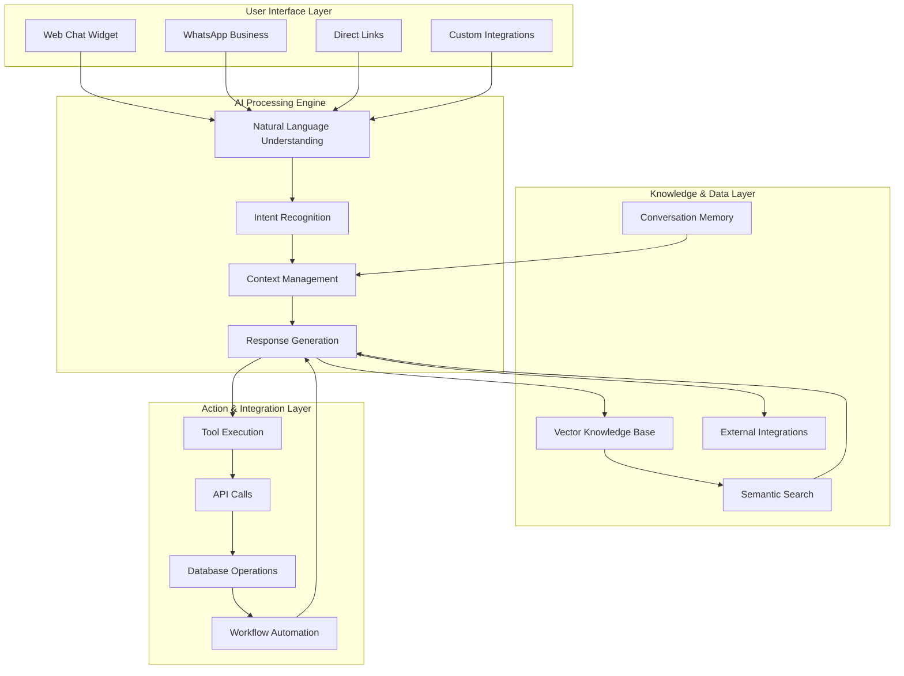
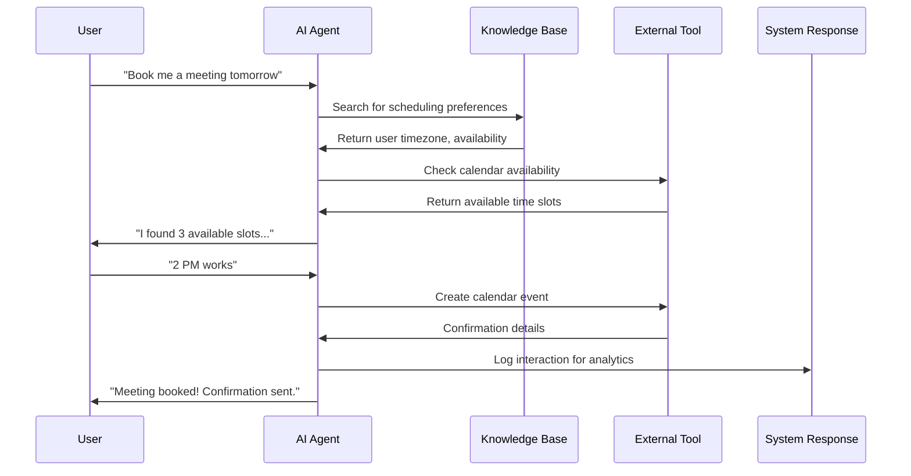

## System Architecture Overview

Tars combines multiple AI technologies to create intelligent conversational agents that understand context, access knowledge, and take actions on behalf of users. Here's how it all works together:



## Core Components

### 🧠 AI Processing Engine

**Natural Language Understanding (NLU)**
- Processes user input to understand intent and extract entities
- Handles multiple languages and dialects
- Recognizes context from previous conversation turns
- Adapts to different communication styles and tones

**Intent Recognition**
- Identifies what the user wants to accomplish
- Maps requests to appropriate actions or responses
- Handles ambiguous or complex multi-part requests
- Learns from interactions to improve accuracy over time

**Context Management**
- Maintains conversation state across multiple turns
- Remembers user preferences and previous interactions
- Tracks conversation flow and current objectives
- Manages session data and user authentication

**Response Generation**
- Creates natural, contextually appropriate responses
- Adapts tone and style to match agent personality
- Incorporates knowledge base information seamlessly
- Generates follow-up questions to clarify intent

### 📚 Knowledge & Data Layer

**Vector Knowledge Base**
- Stores information as semantic embeddings for intelligent retrieval
- Supports multiple content types: text, documents, structured data
- Updates automatically as new information is added
- Maintains relevance scoring for accurate responses

**Semantic Search**
- Finds relevant information based on meaning, not just keywords
- Handles synonyms, related concepts, and context
- Ranks results by relevance and recency
- Provides source attribution for transparency

**External Integrations**
- Real-time data access from CRM, databases, and APIs
- Secure authentication and data handling
- Cached responses for performance optimization
- Error handling and fallback mechanisms

**Conversation Memory**
- Short-term memory for current conversation context
- Long-term memory for user preferences and history
- Privacy-compliant data storage and retention
- Configurable memory depth and retention policies

### 🔧 Action & Integration Layer

**Tool Execution**
- Executes actions based on user requests and agent logic
- Handles complex workflows with multiple steps
- Provides real-time status updates and confirmations
- Manages transaction integrity and rollback capabilities

**API Integrations**
- Connects with 50+ popular business tools and platforms
- Custom API support for proprietary systems
- Rate limiting and quota management
- Comprehensive error handling and retry logic

**Workflow Automation**
- Triggers automated processes based on conversation outcomes
- Schedules follow-up actions and reminders
- Manages complex business logic and decision trees
- Provides audit trails for compliance and debugging

## Data Flow Process

### 1. Input Processing
```
User Message → Language Detection → Intent Classification → Entity Extraction → Context Integration
```

### 2. Knowledge Retrieval
```
Processed Intent → Semantic Search → Knowledge Ranking → Source Attribution → Content Preparation
```

### 3. Action Determination
```
Intent + Context → Action Planning → Tool Selection → Parameter Preparation → Execution Queue
```

### 4. Response Generation
```
Knowledge + Actions → Response Drafting → Personality Application → Quality Validation → Delivery
```

## AI Agent Conversation Flow

Understanding how Tars agents handle conversations helps you design better user experiences:

### Conversation Stages

<Columns cols={2}>
  <Card title="1. Greeting & Context" icon="handshake">
    - Welcome message based on entry point
    - Context gathering from previous sessions
    - Personality and tone establishment
    - User preference recognition
  </Card>
  <Card title="2. Intent Understanding" icon="search">
    - Natural language processing of user input
    - Intent classification and confidence scoring
    - Entity extraction and validation
    - Context integration from conversation history
  </Card>
  <Card title="3. Knowledge Retrieval" icon="database">
    - Semantic search across knowledge sources
    - Relevance scoring and ranking
    - Multi-source information synthesis
    - Real-time data integration when needed
  </Card>
  <Card title="4. Response Formulation" icon="message-circle">
    - Natural response generation
    - Personality and brand voice application
    - Call-to-action integration
    - Follow-up question preparation
  </Card>
</Columns>

### Conversation Management

**Multi-turn Conversations**
- Maintains context across multiple exchanges
- Handles topic shifts and tangential questions
- Manages complex requests requiring multiple steps
- Provides conversation summaries when needed

**Error Handling**
- Graceful handling of unclear or ambiguous requests
- Clarifying questions to resolve confusion
- Fallback responses for unsupported scenarios
- Escalation to human agents when appropriate

**Conversation Optimization**
- A/B testing of response variations
- Performance monitoring and improvement suggestions
- User satisfaction tracking and optimization
- Continuous learning from successful interactions

## Integration Workflow

### How Tools Connect and Execute



### Security & Privacy

**Data Protection**
- End-to-end encryption for all data transmission
- SOC 2 Type II compliance for data handling
- GDPR and CCPA compliant privacy controls
- Regular security audits and penetration testing

**Access Control**
- Role-based permissions for team members
- API key management and rotation
- Integration-specific access scoping
- Audit logs for all system activities

## Performance & Scalability

### Response Time Optimization
- **< 200ms** average response time for simple queries
- **< 1 second** for complex knowledge retrieval
- **< 3 seconds** for external API integration
- Global CDN deployment for low latency worldwide

### Scalability Features
- Auto-scaling infrastructure to handle traffic spikes
- Load balancing across multiple data centers
- Horizontal scaling for high-volume deployments
- Performance monitoring and alerting

## Next Steps

Now that you understand how Tars works, explore these key concepts:

<CardGroup cols={2}>
  <Card title="Key Concepts" icon="lightbulb" href="/platform-fundamentals/key-concepts">
    Learn essential terminology and component relationships
  </Card>
  <Card title="Choosing Your Path" icon="map" href="/platform-fundamentals/choosing-your-path">
    Determine the best approach for your use case
  </Card>
  <Card title="Platform Tour" icon="compass" href="/platform-fundamentals/platform-tour">
    Take an interactive walkthrough of the Tars interface
  </Card>
  <Card title="Start Building" icon="hammer" href="/quickstart">
    Create your first agent with our step-by-step guide
  </Card>
</CardGroup>

<Note>
  **Technical Deep Dive:** For detailed technical information about AI models, vector embeddings, and system architecture, visit our [Technical Deep Dive](/ai-technology/understanding-llms) section.
</Note>
