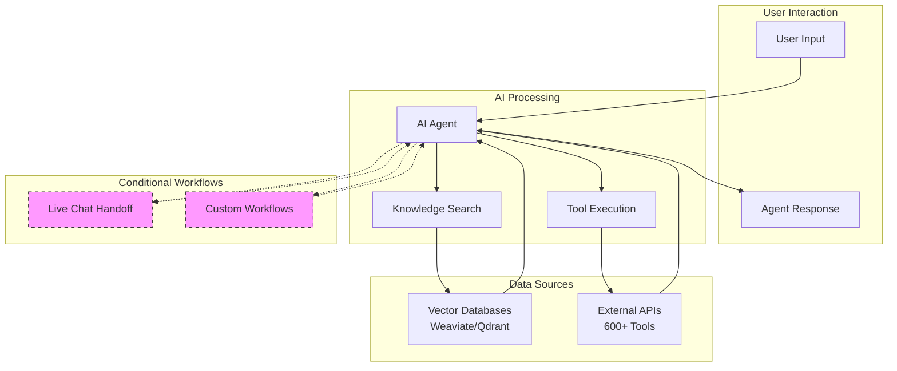

### Platform Philosophy

**Conversational Automation**
Tars replaces static forms and landing pages with dynamic, step-by-step interactions that guide users progressively through personalized conversations, presenting information at the right moment rather than overwhelming them with everything at once.

## Core Component Relationships

### AI Agents vs Traditional Chatbots

<Tabs>
<Tab title="AI Agents (Tars Approach)">
**Intelligent Conversation Processing**

Tars AI Agents function as sophisticated conversation handlers that understand context and intent:

- **Natural Language Understanding**: Comprehends user intent beyond simple keyword matching
- **Context Awareness**: Maintains conversation history and learns user preferences
- **Dynamic Intelligence**: Adapts responses based on conversation flow and user behavior
- **Tool Integration**: Automatically determines when and how to use external systems
- **Personality Expression**: Maintains consistent brand voice and behavior patterns

<Check>
AI Agents handle unexpected inputs gracefully and provide human-like conversational experiences.
</Check>
</Tab>

<Tab title="Traditional Chatbots">
**Rule-Based Decision Trees**

Traditional chatbots follow predetermined conversation paths:

- **Keyword Dependency**: Relies on exact phrase recognition and matching
- **Linear Flow**: Follows rigid, pre-programmed conversation sequences
- **Limited Flexibility**: Breaks down when users deviate from expected inputs
- **Manual Programming**: Requires extensive coding for each conversation scenario
- **Static Responses**: Provides identical outputs for similar inputs

<Warning>
Traditional chatbots struggle with natural language variations and unexpected user behavior.
</Warning>
</Tab>
</Tabs>

### Platform Component Architecture

**How Components Work Together**

## Decision Framework

### Implementation Planning

<CardGroup cols={2}>
  <Card
    title="Decision Framework"
    icon="compass"
    href="/platform-fundamentals/decision-framework"
  >
    **Strategic Planning Guide**
    - Platform selection criteria
    - Integration requirements assessment
    - Development approach recommendations
  </Card>

  <Card
    title="Choosing Your Path"
    icon="map"
    href="/platform-fundamentals/choosing-your-path"
  >
    **Personalized Guidance**
    - User journey recommendations
    - Technical requirements evaluation
    - Resource and timeline planning
  </Card>
</CardGroup>

## Best Practices

### Strategic Planning

<CardGroup cols={2}>
  <Card
    title="Implementation Strategy"
    icon="strategy"
    href="/introduction-to-development/getting-started-with-workflow"
  >
    **Development Best Practices**
    - Goal-oriented development approach
    - User-centered design principles
    - Quality assurance guidelines
  </Card>

  <Card
    title="Success Guidelines"
    icon="target"
    href="/platform-fundamentals/platform-tour"
  >
    **Platform Tour & Guidelines**
    - Interactive platform walkthrough
    - Feature exploration and understanding
    - Best practice recommendations
  </Card>
</CardGroup>

## Next Steps

Ready to apply these concepts to your specific use case?

<CardGroup cols={2}>
  <Card
    title="Development Lifecycle"
    icon="code"
    href="/introduction-to-development/development-lifecycle-overview"
  >
    **Complete Development Process**
     
    Understand the Make → Test → Deploy → Analyze → Iterate workflow
  </Card>

  <Card title="Start Building" icon="rocket" href="/quickstart">
    **Quick Tutorial** Create your first agent with our step-by-step guide
  </Card>

  <Card
    title="Explore Components"
    icon="puzzle-piece"
    href="/ai-agents/understanding-ai-agents/what-are-ai-agents"
  >
    **Deep Dive into Components**
    Detailed configuration and setup for each platform component
  </Card>

  <Card
    title="Use Case Examples"
    icon="lightbulb"
    href="/use-case-examples/customer-support/helpdesk-automation"
  >
    **Real-World Examples**
    Industry-specific implementations and success stories
  </Card>
</CardGroup>

<Note>
  **Questions about implementation?** Join our [Community
  Forum](/community-support/community-forum) to connect with other Tars users
  and get expert guidance from our team.
</Note>
