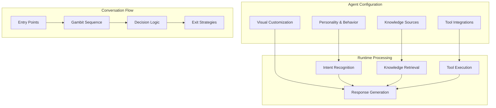

## Core Terminology

Understanding these fundamental concepts will help you navigate the Tars platform and documentation effectively.

### 🤖 AI Agents vs Components

**AI Agents**
- Complete conversational entities with personality, knowledge, and capabilities
- Can handle end-to-end conversations independently
- Combine multiple components to deliver comprehensive experiences
- Deploy as standalone applications across multiple channels

**Components**
- Individual building blocks that make up an agent's functionality
- Include gambits, knowledge bases, integrations, and styling elements
- Reusable across multiple agents and scenarios
- Configurable and customizable for specific use cases

<Columns cols={2}>
  <Card title="Think of Agents as..." icon="robot">
    **Complete Applications**
    - Customer service representative
    - Sales qualification specialist
    - Booking assistant
    - Technical support agent
  </Card>
  <Card title="Think of Components as..." icon="puzzle-piece">
    **Building Blocks**
    - Question-asking forms
    - Knowledge search capabilities
    - Integration connections
    - Visual styling elements
  </Card>
</Columns>

### 🎯 Conversation Flow Basics

**Gambits**
The fundamental building blocks of conversations in Tars. Each gambit represents a single interaction point with specific functionality:

- **AI Gambits**: Intelligent processing (intent detection, Q&A, data extraction)
- **Input Gambits**: Collect information from users (text, buttons, uploads)
- **Integration Gambits**: Connect with external tools and systems
- **Logic Gambits**: Control conversation flow and decision-making

**The Gambit → Response → Action Cycle**
```
User Input → Gambit Processing → AI Analysis → Knowledge Retrieval → Response Generation → Next Action
```

**Flow Logic**
- **Sequential Flow**: Move from one gambit to the next in order
- **Conditional Branching**: Different paths based on user responses or data
- **Jumping**: Skip to specific gambits based on logic conditions
- **Loops**: Repeat sections for iterative processes

### 📊 Data Flow Overview

**User Input → Processing → Response Path**

1. **Input Capture**: User provides text, selections, or uploads
2. **Intent Processing**: AI analyzes what the user wants to accomplish
3. **Knowledge Search**: System finds relevant information from knowledge bases
4. **Tool Integration**: External systems provide additional data or perform actions
5. **Response Generation**: AI creates contextually appropriate responses
6. **Action Execution**: Any required actions are performed (bookings, data updates, etc.)

### 🧠 Understanding Intelligence Levels

**Rule-Based Responses (Traditional)**
- Follow pre-defined if/then logic
- Limited to exact keyword matches
- Require manual programming for each scenario
- Break down with unexpected inputs

**AI-Powered Responses (Tars)**
- Understand context and intent
- Handle variations in language and phrasing
- Learn and improve from interactions
- Gracefully handle unexpected scenarios

### 📚 Knowledge Management

**Vector Embeddings**
- Mathematical representations of text meaning
- Allow semantic search (meaning-based, not keyword-based)
- Enable finding related concepts and synonyms
- Support multi-language understanding

**Knowledge Sources**
- **Website Scraping**: Automatic content import from URLs
- **Document Upload**: PDFs, Word docs, text files
- **Manual Entry**: Direct FAQ and response creation
- **Structured Data**: CSV files, database connections
- **API Integration**: Real-time data from external systems

**Knowledge Processing**
- **Ingestion**: Content is processed and converted to searchable format
- **Training**: Vector embeddings are created for semantic search
- **Indexing**: Information is organized for fast retrieval
- **Optimization**: Performance tuning for accuracy and speed

## Platform Architecture Concepts

### 🏗️ Agent Structure



### 🔄 Conversation State Management

**Session Context**
- Current conversation state and user progress
- Temporary data collected during the interaction
- User preferences for the current session
- Active tool connections and authentication

**User Profile**
- Long-term user preferences and history
- Previous conversation summaries
- Behavioral patterns and learning data
- Privacy settings and consent status

**Agent Memory**
- Conversation history for context
- User identification and recognition
- Custom variables and data storage
- Integration state and cached results

### 🛠️ Integration Ecosystem

**Native Integrations**
- Pre-built connectors for popular platforms
- One-click setup with guided configuration
- Automatic updates and maintenance
- Optimized performance and reliability

**Custom Integrations**
- REST API support for any system
- Webhook capabilities for real-time updates
- Custom authentication methods
- Advanced data transformation options

**Integration Categories**
- **CRM Systems**: Customer data and interaction history
- **Productivity Tools**: Calendars, documents, spreadsheets
- **Communication**: Email, SMS, messaging platforms
- **E-commerce**: Product catalogs, orders, payments
- **Analytics**: Tracking, reporting, business intelligence

## User Journey Framework

### 🎪 Entry Points

**How Users Start Conversations**
- **Website Widget**: Chat bubble on your website
- **Direct Link**: Standalone agent URLs
- **WhatsApp**: Business messaging integration
- **Embedded**: Custom integration in apps or systems

**Context Awareness**
- **Referral Source**: How the user arrived at the agent
- **Page Context**: What page they were viewing
- **User History**: Previous interactions and preferences
- **Campaign Tracking**: Marketing attribution and analytics

### 🎭 Conversation Personas

**Business User Journey**
- Template-first approach for quick setup
- Focus on common business scenarios
- Minimal technical configuration required
- Emphasis on results and ROI

**Technical User Journey**
- Component-first approach for maximum flexibility
- Custom integrations and advanced configurations
- API access and programmatic control
- Developer tools and documentation

**Marketer Journey**
- Lead generation and conversion optimization
- Campaign integration and tracking
- A/B testing and performance analytics
- Multi-channel deployment strategies

**Customer Service Journey**
- Support automation and ticket management
- Knowledge base integration and management
- Escalation workflows and human handoff
- Performance monitoring and optimization

## Decision Framework

### 🤔 Key Questions to Guide Your Implementation

**Do I Need Integrations?**
- **Standalone Agents**: Information-only, no external data needed
- **Connected Agents**: Require CRM, calendar, or database access
- **Complex Workflows**: Multi-step processes across multiple systems

**Web vs WhatsApp vs Multi-Platform?**
- **Web Only**: Website visitors and customer portal users
- **WhatsApp Focus**: Mobile-first audience and regional preferences
- **Multi-Platform**: Comprehensive customer engagement strategy

**Template vs Custom Build?**
- **Template Approach**: Common use cases with proven patterns
- **Custom Build**: Unique requirements or complex workflows
- **Hybrid Approach**: Template starting point with custom modifications

## Best Practices

### 🎯 Planning Your Agent

1. **Define Clear Objectives**: What should your agent accomplish?
2. **Understand Your Users**: Who will interact with your agent and how?
3. **Map User Journeys**: What paths will users take through conversations?
4. **Identify Integration Needs**: What systems need to connect?
5. **Plan for Scale**: How will usage grow over time?

### 🔧 Implementation Strategy

1. **Start Simple**: Begin with core functionality and expand
2. **Test Early**: Validate assumptions with real user interactions
3. **Iterate Quickly**: Use feedback to improve and optimize
4. **Monitor Performance**: Track metrics and user satisfaction
5. **Scale Gradually**: Add complexity as you gain experience

## Next Steps

Ready to apply these concepts? Choose your next step:

<CardGroup cols={2}>
  <Card title="Choose Your Path" icon="map" href="/platform-fundamentals/choosing-your-path">
    Determine the best approach for your specific needs and goals
  </Card>
  <Card title="Platform Tour" icon="compass" href="/platform-fundamentals/platform-tour">
    See these concepts in action with an interactive walkthrough
  </Card>
  <Card title="Start Building" icon="rocket" href="/quickstart">
    Jump into creating your first agent with our guided tutorial
  </Card>
  <Card title="Explore Examples" icon="lightbulb" href="/use-case-examples/customer-support/helpdesk-automation">
    See real-world implementations across different industries
  </Card>
</CardGroup>

<Note>
  **Questions about specific concepts?** Visit our [Community Forum](/getting-help/community-forum) to connect with other Tars users and get expert guidance.
</Note>
