## What You'll Build

By the end of this guide, you'll have a **fully functional AI support agent** that:

<Columns cols={2}>
  <Card title="Intelligent Q&A" icon="brain">
    - Answers customer questions from your knowledge base
    - Provides accurate, source-cited responses
    - Available 24/7 without human intervention
  </Card>
  <Card title="Automated Ticketing" icon="ticket">
    - Collects user details when needed
    - Creates support tickets automatically
    - Sends email confirmations to customers
  </Card>
  <Card title="Professional Design" icon="palette">
    - Custom branded chat interface
    - Mobile-responsive design
    - Engaging widget with callout
  </Card>
  <Card title="Production Ready" icon="circle-check">
    - Fully tested and optimized
    - Multiple deployment options
    - Analytics and conversation tracking
  </Card>
</Columns>

---

## Agent Workflow Overview

Your AI agent connects to your knowledge sources and tools to provide intelligent support:

```mermaid
graph TB
    USER(👤 User)
    AGENT(🤖 AI Agent)
    KNOWLEDGE(📚 Knowledge Source)
    TOOLS(🔧 Tools)
    
    USER --> AGENT
    AGENT --> KNOWLEDGE
    AGENT --> TOOLS
    
    style USER fill:#e1f5fe
    style AGENT fill:#f3e5f5
    style KNOWLEDGE fill:#e8f5e8
    style TOOLS fill:#fff3e0
```



**How it works:**
1. **User asks a question** - The AI agent receives the question
2. **Agent searches knowledge** - Retrieves relevant information from your knowledge base
3. **Agent provides answer** - Responds based on the knowledge found
4. **If user needs more help** - Agent uses tools to create support tickets and send emails
5. **Support team gets notified** - Both user and team receive confirmations

---

## Prerequisites

Before we start building, ensure you have everything ready:

- ✅ **Tars Account** - [Create account](/getting-help/account-setup) if you don't have one
- ✅ **Gmail Account** - Use your support email for professional communication  
- ✅ **HubSpot Account** - [Create free account](https://www.hubspot.com/products/crm) for advanced ticket management (optional)

<Info>
**Setup Time:** Account creation takes 2-3 minutes. Gmail is required for all setups, while HubSpot is optional for advanced ticket management.
</Info>

## Add Knowledge Sources

Your AI agent needs knowledge to answer customer questions accurately. Let's add your company's information.

<Steps>
  <Step title="Navigate to Knowledge Bases" icon="database">
    1. **Navigate** to the [Knowledge Bases](https://app.hellotars.com/knowledge) section in your Tars dashboard
    2. **Click** `Add Knowledge` to create a new knowledge base
    3. **Choose** your data source type (`Website`, `PDF`, `CSV`, or `Q&A`)
    4. **Fill** in the required fields
    5. **Add** your Data Resources
    6. **Fetch** your data
    7. **Train** your knowledge base
    8. **Ready to Use** - Knowledge base appears in `My Knowledge Bases` section

  </Step>
  
  <Step title="Follow the Detailed Guide" icon="book">
    For complete step-by-step instructions on creating knowledge bases, follow our comprehensive guide:
    
    <Card title="Knowledge Base Creation Guide" icon="book" href="/platform-fundamentals/platform-tour#knowledge">
      Complete guide covering all data source types, training, and testing your knowledge base.
    </Card>
    
    **Quick Overview:**
    - **Website Scraping**: Best for existing FAQ pages or documentation
    - **PDF Upload**: Best for technical manuals and documents  
    - **CSV Files**: Best for structured data or Q&A pairs
    - **Manual Entry**: Best for small FAQ sets with precise control
  </Step>
  
  <Step title="Example: Create Tars Docs Knowledge Base" icon="book">
    For this tutorial example, we'll create a knowledge base using Tars help documentation:
    
    **Configuration:**
    - **Knowledge Base Name**: `Tars Docs`
    - **Data Source**: `Website URL`
    - **URL**: `https://help.hellotars.com` (Tars help documentation)
    - **Settings**: `Use default settings for optimal results`
    
    **What happens next:**
    1. **Fetch Links** - System discovers and scrapes all documentation pages
    2. **Training** - AI processes and indexes the content for search
    3. **Ready to Use** - Knowledge base appears in `My Knowledge Bases` section
    <Frame>
      
    </Frame>
  </Step>

</Steps>

<Check>
  **Knowledge Base Ready!** Your agent now has the knowledge to answer customer questions accurately.
</Check>

## Connect Tools

Now let's connect the tools your agent needs to create support tickets and send email confirmations.

<Steps>
  <Step title="Navigate to Tools" icon="plug">
    1. Navigate to the [Tools](https://app.hellotars.com/tools) section in your Tars dashboard
    2. Click [Add Tools](https://app.hellotars.com/tools?tab=all-tools) to see available integrations
    3. Search for **Gmail** and **HubSpot** (if using advanced setup)

<CardGroup cols={2}>
  <Card title="Search for Tools">
    
  </Card>
  <Card title="Configure Tool">
    
  </Card>
  <Card title="Tool Name Setup">
    
  </Card>
  <Card title="Connect Tool">
    
  </Card>
  <Card title="Verify Your Connections">
      
  </Card>
</CardGroup>

  </Step>
  
  <Step title="Follow the Detailed Guide" icon="book">
    For complete step-by-step instructions on connecting tools, follow our comprehensive guide:
    
    <Card title="Tools Connection Guide" icon="external-link" href="/platform-fundamentals/platform-tour#tools">
      Complete guide covering Gmail setup, HubSpot integration, and tool configuration.
</Card>

    **Quick Overview:**
    - **Gmail**: Required for sending customer confirmation emails
    - **HubSpot**: Optional for advanced ticket management and CRM integration
  </Step>
  <Step title="Verify Your Connections" icon="flask">
    After completing the authentication flow, you'll be redirected back to the tool configuration page.
    
    **Connection Status:**
    - ✅ **Connected** - Tool is successfully authenticated and ready to use
    - ❌ **Error** - Authentication failed or connection issue
<Frame>
        
</Frame>

      <Tip>
      If you see an error, refresh the page and check if the tool is connected. You may need to reconnect or check your permissions.
      </Tip>
  </Step>
  
</Steps>


## Create Your Agent

Now let's build your AI agent from scratch and configure it step by step.

<Steps>
  <Step title="Create Agent from Scratch" icon="plus">
    1. **Navigate** to the [Create Agents](https://app.hellotars.com/agents?tab=create-agent) page in your Tars dashboard
    2. **Click** the Create from Scratch card
    3. **Enter** agent details:
       - **Name:** CloudFlow Support Agent
       - **Description:** AI-powered customer support assistant
       - **Icon:** Choose or shuffle for a custom icon
    4. **Click** Create Agent
      
      <Tip>
    Not sure? Revisit [Platform Tour](/platform-fundamentals/platform-tour#create-agent)
      </Tip>

  <Frame>
      
  </Frame>
  </Step>
  
  <Step title="Enter Builder Canvas" icon="paint-brush">
    You'll be redirected to the Builder Canvas. Add the Agent Gambit and create a self-loop for continuous conversation.
    
    <Frame>
      
    </Frame>
  </Step>
  
  <Step title="Self-Loop the Agent" icon="arrows-rotate">
    Connect the agent output back to itself to allow multiple questions in one session.
    
    <Frame>
      
    </Frame>
  </Step>
  
  <Step title="Publish and Preview" icon="play">
    Click `Publish` and then `Preview` to test your basic agent setup.
    
    <Frame>
      
    </Frame>
  </Step>
  
  <Step title="Add Knowledge Base" icon="database">
    Drag the Knowledge Base gambit onto the canvas and select "Tars Docs" from the dropdown.
    
    <Frame>
      
    </Frame>
  </Step>
  
  <Step title="Select Knowledge Base" icon="check">
    Choose your created knowledge base from the dropdown menu.
    
    <Frame>
      
    </Frame>
  </Step>
  
  <Step title="Connect Knowledge Base" icon="link">
    Connect the Knowledge Base output to the Agent Gambit to enable access.

<Frame>
      
</Frame>
  </Step>
  
  <Step title="Test with Knowledge" icon="flask">
    Publish and test by asking questions from your knowledge base.
    
    <Frame>
      
    </Frame>
  </Step>
  
  <Step title="Add Gmail Tool" icon="envelope">
    Drag the Tool gambit onto the canvas and select your configured Gmail tool.
    
    <Frame>
      
    </Frame>
  </Step>
  
  <Step title="Select Gmail Tool" icon="check">
    Choose your connected Gmail tool from the dropdown and configure email settings.
    
    <Frame>
      
    </Frame>
  </Step>
  
  <Step title="Connect Gmail Tool" icon="link">
    Connect the Tool output to the Agent Gambit to enable email functionality.
    
    <Frame>
      
    </Frame>
  </Step>
  <Step title="Configure Agent Settings" icon="gear">
    Click on the Agent Gambit to open configuration panel and customize your agent's behavior.

<Tabs>
      <Tab title="Welcome Message">
        **Welcome Message** appears only when users first interact with the agent or when coming from another gambit.
        
        - Shown at the beginning of the conversation
        - Not shown on self-loop (continuous conversation)
        - Used for greeting and providing initial context
        
        **Example:**
        ```
        Hi! I'm your CloudFlow Support Assistant. 
        I can help you with product questions, account issues, and technical support.
        How can I assist you today?
        ```
  </Tab>
  
      <Tab title="Basic Settings">
        Configure the core agent behavior and AI model settings.
        
        **LLM Model Selection:**
        Choose from over 60 models available through subscription, each offering unique capabilities to suit your needs.
        - **GPT-4o-Mini**: Choosing the default model for this tutorial
        
        **Temperature:**
        - Range: 0.0 to 1.0
        - **0.7**: Balanced creativity and consistency (recommended)
        - Lower values = More focused and deterministic
        - Higher values = More creative and varied
  </Tab>
  
      <Tab title="Advanced Settings">
        Fine-tune agent behavior with advanced configurations.
        
        **Available Options:**
        - **Chat History**: Enable to maintain conversation context
        - **Support Markdown**: Allow formatted responses with bold, lists, etc.
        - **Show Tool Call Events**: Display when agent uses tools
        - **View Sources**: Show knowledge base citations
        - **Get User Feedback**: Enable satisfaction tracking
        
        <Tip>
          Enable all options for the best user experience and transparency.
        </Tip>
  </Tab>
  
      <Tab title="Jump Logic">
        Define success criteria for agent responses.
        
        **Success Prompt:**
        - Define what constitutes a successful answer
        - Agent marks conversation as resolved when criteria is met
        - Anything outside success criteria is considered unanswered
        
        **Configuration:**
        - Set success conditions based on your use case
        - Helps track agent performance and resolution rates
        
        <Info>
          For this tutorial, we'll configure success as providing relevant information from the knowledge base.
        </Info>
  </Tab>
</Tabs>
  </Step>
  
  <Step title="Customize Agent Prompt" icon="wand-magic-sparkles">
    Configure the agent's system prompt to define personality, answer criteria, and behavior guidelines.
    
    <Tabs>
      <Tab title="Complete Prompt">
        Copy and paste these prompt sections into your agent's system prompt field:
        
        **1. Introduction & Role Definition:**
        ```text
        You are **Tars Guide AI**, the official representative of Tars. Your role is to provide accurate, concise, and well-structured guidance based on the official Tars helpdocs. Always maintain a professional yet friendly tone, and use **Markdown formatting** to make responses visually clear and easy to follow.
        ```
        
        **2. Personality & Tone:**
        ```text
        ### **1. Personality & Tone**

        As Tars Guide AI, you represent the company with professionalism and clarity. Keep your answers short, precise, and easy to read. Maintain a friendly, approachable voice while staying authoritative. Use formatting elements like **bold text**, *italics*, bullet points, and headers for clarity. Avoid unnecessary length and avoid casual or off-topic replies.
        ```
        
        **3. Knowledge Retrieval & Response Rules:**
        ```text
        ### **2. Knowledge Retrieval & Response Rules**
        For answering questions related to company and its product always use knowledge_retrieve tool and try to answer from the data you have from the tool response. If you don't find any answer from the knowledge_retrieve tool for any particular question, convey the same to the users in a polite manner.
        - Provide the response in a concise, structured, and easy-to-follow manner.
        - Use **step-by-step formatting** for instructional answers only if needed and asked.
        - Keep the answer short and concise don't add any unwanted details.
        - Always speak as we , **Tars company representative** providing official guidance. Don't deviate from the objective.
        ---
        ```
        
        **4. Escalation Conditions:**
        ```text
        ### **3. Escalation & Support Process**

        At the end of **every response**, suggest politely that the user can reach out to the Tars team if they need more help.

        If the user requests support:

        1. Ask for the following details:

           * **Full Name**
           * **Email ID**
           * **One key question or issue** they want support on
        2. Once collected, prepare a **support escalation email** using the Gmail tool with this template:
        ```
        
        **5. Support Email Template:**
        ```text
        #### **Support Email Template**

        **Subject:** User Support Request – Tars Platform

        **Body:**
        Hello Tars Support Team,

        A user has requested assistance. Here are the details:

        * **Username:** {`{{fullname}}`}
        * **Email ID:** {`{{email}}`}
        * **Issue/Question:** {`{{user_question}}`}

        Please reach out to the user to provide further support.

        Thank you,
        Tars Guide AI

        ---

        After sending the email, politely confirm to the user:

        > *"Your request has been forwarded to our support team. They will get in touch with you shortly via email."*

        ---
        ```
        
        **6. Key Guidelines:**
        ```text
        ### **4. Key Guidelines**

        * **Tone:** Friendly, professional, and concise.
        * **Format:** Always use Markdown for readability.
        * **Scope:** Answer only from Tars helpdocs and platform documentation.
        * **Escalation:** End every response by asking if the user would like team support. If yes, follow the support process above.
        ```
        
        <Tip>
          Copy each section in order and paste them all together into your agent's system prompt field for the complete prompt.
        </Tip>
      </Tab>
  
      <Tab title="Prompt Breakdown">
        Understanding why each section matters for your agent's success:
        
        <Steps>
          <Step title="Personality & Tone" icon="user-tie">
            **What it does:** Defines your agent's character and communication style.
            
            **Why it matters:** This section establishes how users perceive your brand and company. By setting clear guidelines for being professional yet friendly, using Markdown formatting, and keeping responses concise, you ensure every interaction reflects your company's values. This consistency builds trust and makes users feel they're talking to a knowledgeable, helpful representative rather than a robotic chatbot.
          </Step>
          
          <Step title="Knowledge Retrieval & Response Rules" icon="brain">
            **What it does:** Controls how your agent finds and delivers information.
            
            **Why it matters:** This is the brain of your agent - it determines accuracy and reliability. The rule to always use the `knowledge_retrieve` tool ensures your agent only provides accurate, up-to-date information from your official documentation. This prevents hallucinations and keeps responses grounded in facts. The fallback mechanism (politely acknowledging when no answer is found) maintains user trust by being honest about limitations rather than making up answers.
          </Step>
          
          <Step title="Escalation & Support Process" icon="life-ring">
            **What it does:** Handles situations when your agent can't provide an answer.
            
            **Why it matters:** This section is your safety net for customer satisfaction. By ending every response with a support offer, you ensure users never feel abandoned. The structured data collection (name, email, question) and automated email system means your human support team gets all the context they need to provide personalized help quickly. This seamless handoff prevents frustrated users and maintains service quality.
          </Step>
          
          <Step title="Key Guidelines" icon="shield-check">
            **What it does:** Sets the guardrails that keep your agent focused and effective.
            
            **Why it matters:** These guidelines ensure consistent behavior across all interactions, maintain your brand voice, and keep the agent from going off-topic. The emphasis on Markdown formatting makes responses more readable and professional, while the scope limitation to Tars helpdocs prevents the agent from discussing unrelated topics that could confuse users or damage your brand reputation.
          </Step>
        </Steps>
      </Tab>
      

    </Tabs>
    
    <Tip>
      This prompt ensures your agent maintains consistent brand voice, provides accurate information, and handles escalations professionally.
    </Tip>
  </Step>
  
  <Step title="Final Testing" icon="flask">
    Publish and test the complete workflow with all configurations.
    
    <Frame>
      
    </Frame>
  </Step>
</Steps>

<Check>
  **Agent Complete!** Your agent now has knowledge base integration and tool functionality.
</Check>

---

## Customize Design & Appearance

Make your agent look professional and match your brand.

<Steps>
  <Step title="Customize Chat Widget" icon="palette">
    Design your chat widget appearance:
    
    1. **Click** "Design" tab in the builder
    2. **Configure** widget settings:
       - **Widget Icon:** Upload your company logo
       - **Widget Color:** Match your brand colors
       - **Widget Position:** Bottom right (recommended)
       - **Widget Size:** Medium (optimal for support)
    3. **Preview** changes in real-time
    
    <Frame>
      
    </Frame>
  </Step>
  
  <Step title="Customize Chat Interface" icon="paint-brush">
    Style the chat window appearance:
    
    **Chat Interface Settings:**
    - **Header Color:** Your brand primary color
    - **Header Text:** "CloudFlow Support"
    - **Header Icon:** Your company logo
    - **Message Bubbles:** Customize colors and fonts
    - **Background:** Light theme (recommended for support)
    
    <Frame>
      
    </Frame>
  </Step>
  
  <Step title="Configure Agent Settings" icon="gear">
    Set up agent metadata and SEO:
    
    **Agent Configuration:**
    - **Agent Name:** CloudFlow Support Assistant
    - **Description:** AI-powered customer support for CloudFlow users
    - **Keywords:** support, help, customer service, CloudFlow
    - **Language:** English (US)
    - **Timezone:** Your local timezone
    
    **SEO Settings:**
    - **Page Title:** CloudFlow Support - Get Help Instantly
    - **Meta Description:** Get instant help with CloudFlow. Our AI assistant can answer questions 24/7.
    - **Favicon:** Your company favicon
    
    <Tip>
      These settings help with search engine optimization if you deploy as a standalone page.
    </Tip>
  </Step>
</Steps>

<Check>
  **Design Complete!** Your agent now has a professional appearance that matches your brand.
</Check>

---

## Test Your Agent

Thoroughly test your agent before going live to ensure everything works correctly.

<Steps>
  <Step title="End-to-End Testing" icon="flask">
    Test the complete conversation flow:
    
    1. **Open** agent preview
    2. **Test** knowledge base questions:
       - "How do I reset my password?"
       - "What payment methods do you accept?"
       - "How do I cancel my subscription?"
    3. **Test** satisfaction check:
       - Click "Yes, that helped!" → Should show thank you
       - Click "No, I need more help" → Should start ticket flow
    4. **Test** ticket creation:
       - Fill out all fields (name, email, issue, priority)
       - Verify email is sent to your test email
       - Check email formatting and content
    
    <Frame>
      
    </Frame>
  </Step>
  
  <Step title="Test Edge Cases" icon="exclamation-triangle">
    Test scenarios that might break your agent:
    
    **Edge Cases to Test:**
    - Questions not in knowledge base
    - Invalid email formats
    - Very long issue descriptions
    - Empty form submissions
    - Special characters in inputs
    - Questions in different languages (if applicable)
    
    <Warning>
      Make sure your agent handles these gracefully with appropriate error messages.
    </Warning>
  </Step>
  
  <Step title="Review Conversation Data" icon="chart-bar">
    Check the data view to see conversation analytics:
    
    1. **Click** "Data View" tab in the builder
    2. **Review** conversation logs
    3. **Export** test conversations to CSV
    4. **Check** that all data is captured correctly:
       - User messages
       - Agent responses
       - Form submissions
       - Email sends
    
    <Frame>
      
    </Frame>
  </Step>
</Steps>

<Check>
  **Testing Complete!** Your agent is ready for deployment and real users.
</Check>

---

## Deploy Your Agent

Launch your agent and make it available to your customers.

<Steps>
  <Step title="Choose Deployment Method" icon="rocket">
    Select how you want to deploy your agent:
    
    <Tabs>
      <Tab title="Website Widget">
        **Best for:** Adding to existing website
        
        1. **Click** "Deploy" → "Website Widget"
        2. **Copy** the embed code
        3. **Add** to your website's HTML
        4. **Test** on your live website
        
        <Frame>
          
        </Frame>
      </Tab>
      
      <Tab title="Standalone Link">
        **Best for:** Sharing via email, social media, or QR codes
        
        1. **Click** "Deploy" → "Standalone Link"
        2. **Copy** the public URL
        3. **Share** with customers
        4. **Test** the public link
        
        <Frame>
          
        </Frame>
      </Tab>
      
      <Tab title="Custom Domain">
        **Best for:** Professional branding (e.g., support.yourcompany.com)
        
        1. **Click** "Deploy" → "Custom Domain"
        2. **Configure** DNS settings
        3. **Set up** SSL certificate
        4. **Test** custom domain
        
        <Tip>
          Custom domains require DNS configuration and may take 24-48 hours to propagate.
        </Tip>
      </Tab>
    </Tabs>
  </Step>
  
  <Step title="Monitor Performance" icon="chart-line">
    Track your agent's performance after deployment:
    
    **Key Metrics to Monitor:**
    - **Conversation Volume:** Number of chats per day/week
    - **Resolution Rate:** % of questions answered by knowledge base
    - **Escalation Rate:** % of conversations that create tickets
    - **User Satisfaction:** Feedback from satisfaction checks
    - **Response Time:** How quickly the agent responds
    
    **Access Analytics:**
    1. **Go** to "Analytics" in your dashboard
    2. **View** real-time conversation data
    3. **Export** reports for analysis
    4. **Set up** alerts for unusual activity
    
    <Frame>
      
    </Frame>
  </Step>
  
  <Step title="Continuous Improvement" icon="arrows-rotate">
    Keep improving your agent based on real user interactions:
    
    **Weekly Review Process:**
    1. **Review** conversation logs
    2. **Identify** common questions not in knowledge base
    3. **Add** new content to knowledge base
    4. **Retrain** knowledge base with new content
    5. **Update** agent responses based on feedback
    6. **Test** improvements before deploying
    
    **Monthly Optimization:**
    - Analyze user satisfaction scores
    - Review escalation patterns
    - Update email templates
    - Optimize conversation flow
    - Add new integrations if needed
    
    <Tip>
      The best agents evolve based on real user data. Regular updates ensure continued success.
    </Tip>
  </Step>
</Steps>

<Check>
  **Agent Deployed!** Your AI support agent is now live and helping customers 24/7.
</Check>


## Congratulations! 🎉

You've successfully built a complete AI support agent with:

✅ **Knowledge Base Integration** - Answers questions from your documentation  
✅ **Intelligent Escalation** - Creates tickets when human help is needed  
✅ **Email Automation** - Sends confirmations to customers  
✅ **Professional Design** - Matches your brand and looks great  
✅ **Comprehensive Testing** - Thoroughly tested and ready for users  
✅ **Live Deployment** - Available to customers 24/7  

### What's Next?

<Columns cols={2}>
  <Card title="Explore Advanced Features" icon="rocket" href="/make">
    Learn about advanced gambits, integrations, and customization options to make your agent even more powerful.
  </Card>
  <Card title="Scale Your Success" icon="chart-line" href="/analyze">
    Monitor performance, analyze conversations, and continuously improve your agent based on real user data.
  </Card>
  <Card title="Build More Agents" icon="plus" href="/platform-fundamentals/choosing-your-path">
    Create additional agents for different use cases like sales, HR, or internal support.
  </Card>
  <Card title="Join the Community" icon="users" href="/getting-help/community-forum">
    Connect with other Tars users, share experiences, and get help from the community.
  </Card>
</Columns>


<Note>
**Need Help?** If you run into any issues or have questions, check out our [Support Resources](/getting-help) or join our [Community Forum](/getting-help/community-forum) for help from other users and the Tars team.
</Note>