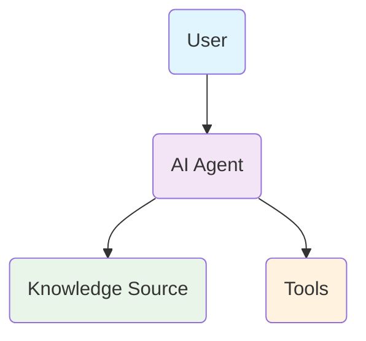

## Agent Workflow Overview

Your AI agent connects to your knowledge sources and tools to provide intelligent support:

**How it works:**
1. **User asks a question** - The AI agent receives the question
2. **Agent searches knowledge** - Retrieves relevant information from your knowledge base
3. **Agent provides answer** - Responds based on the knowledge found
4. **If user needs more help** - Agent uses tools to create support tickets and send emails
5. **Support team gets notified** - Both user and team receive confirmations

---
