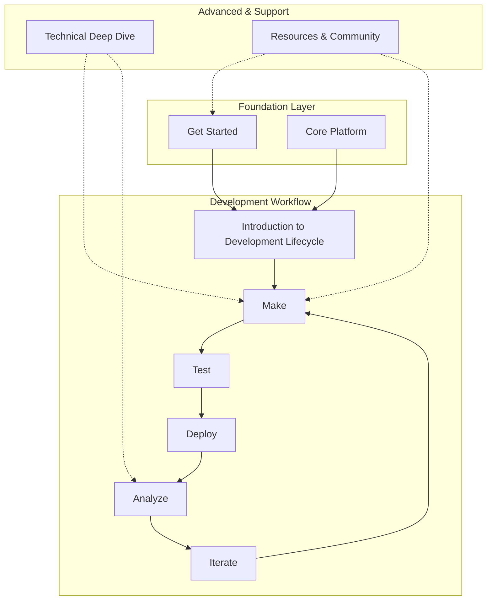

## **📋 Complete Documentation Ecosystem**



---

## **📖 Tars DOCUMENTATION**

### **🚀 Get Started**

_[Foundation Phase - Building Confidence & Understanding]_

```
├── welcome-to-tars/                    # Landing page with value proposition
│   ├── what-is-tars                   # Platform overview & capabilities
│   ├── who-uses-tars                  # Use cases by industry/role
│   └── success-stories                # Customer testimonials & metrics
│
├── platform-fundamentals/             # Essential concepts before building
│   ├── how-tars-works                 # High-level system architecture
│   │   ├── Agent-conversation-flow    # How conversations are processed
│   │   ├── knowledge-retrieval-process # How agents find answers
│   │   └── integration-workflow       # How tools connect and execute
│   ├── key-concepts                   # Terminology & component relationships
│   │   ├── agents-vs-components       # Understanding the ecosystem
│   │   ├── conversation-flow-basics   # Gambit → Response → Action cycle
│   │   └── data-flow-overview         # User Input → Processing → Response
│   ├── choosing-your-path             # User journey guidance
│   │   ├── business-user-journey      # Template-first, customization later
│   │   ├── technical-user-journey     # Component-first, integration-heavy
│   │   ├── marketer-journey           # Lead-gen focused implementation
│   │   └── customer-service-journey   # Support-focused implementation
│   ├── platform-tour                  # Interactive UI walkthrough
│   └── decision-framework             # Simple guidance for getting started
│       ├── do-i-need-integrations     # Standalone vs connected agents
│       ├── web-only-vs-whatsapp       # Platform selection
│       └── template-vs-build-from-scratch # Starting point selection
│
├── quickstart-tutorial/               # Complete end-to-end success path
│   ├── your-first-Agent              # 15-minute guided experience
│   │   ├── step-1-account-setup      # Account & workspace configuration
│   │   ├── step-2-choose-template    # Template selection & preview
│   │   ├── step-3-basic-config       # Essential Agent settings
│   │   ├── step-4-test-preview       # Testing your Agent
│   │   └── step-5-deploy-share       # Publishing & sharing
│   ├── understanding-your-Agent      # Explaining what was created
│   └── next-steps-guide              # Logical progression paths
│
└── getting-help/                      # Support & community resources
    ├── account-setup                  # Account setup guide
    ├── video-tutorials               # Essential video content
    └── community-forum              # Link to community resources
```

### **🏗️ Core Platform**

_[Learning Phase - Understanding Components]_

```
├── ai-agents/                         # Intelligent conversation handling
│   ├── understanding-ai-agents/
│   │   ├── what-are-ai-agents        # Concept & capabilities
│   │   ├── vs-traditional-chatbots   # Key differences & advantages
│   │   │   └── **Traditional chatbots: Series of text inputs/outputs**
│   │   │   └── **AI Agents: Intelligent black box for human-like interaction**
│   │   └── when-to-use-agents        # Use case decision guide
│   ├── Agent-configuration/
│   │   ├── creating-your-Agent       # Step-by-step setup
│   │   ├── personality-settings      # Tone, style, behavior
│   │   └── response-optimization     # Quality & accuracy tuning
│   ├── testing-agents/               # Validation & improvement
│   └── faqs                          # AI Agents specific troubleshooting
│
├── knowledge-bases/                   # Information sources for agents
│   ├── knowledge-fundamentals/
│   │   ├── what-are-knowledge-bases  # Vector database concept
│   │   ├── content-sources-overview  # Different input methods
│   │   └── quality-best-practices    # Content preparation guidelines
│   ├── content-ingestion/
│   │   ├── website-scraping          # URL-based content import
│   │   ├── document-upload           # PDF, DOC, TXT processing
│   │   ├── structured-data           # CSV, JSON integration
│   │   └── manual-entry              # Intent & QA creation
│   ├── knowledge-processing/
│   │   ├── data-fetching             # Extracting content from sources
│   │   ├── training-process          # Vector database creation
│   │   ├── training-parameters       # Configuration options
│   │   └── training-optimization     # Performance tuning
│   ├── using-with-agents/
│   │   ├── quick-integration-guide   # Connecting KB to agents
│   │   ├── search-configuration      # How agents query knowledge
│   │   └── response-customization    # Formatting knowledge responses
│   ├── search-performance/           # Response accuracy tuning
│   └── faqs                          # Knowledge bases troubleshooting
│
├── tools-integration/                 # External system connections
│   ├── tools-fundamentals/
│   │   ├── what-are-tools            # Purpose & capabilities
│   │   ├── available-tools-gallery   # Complete tools catalog
│   │   └── common-tool-actions       # Universal operations across tools
│   │       ├── authentication        # Login/API key patterns
│   │       ├── data-retrieval        # Getting information
│   │       ├── data-creation         # Adding new records
│   │       └── data-updating         # Modifying existing data
│   ├── individual-tools/             # Tool-specific guides
│   │   ├── hubspot/
│   │   │   ├── getting-credentials   # API key setup
│   │   │   ├── configuration-guide   # Tars integration setup
│   │   │   └── available-actions     # What HubSpot tool can do
│   │   ├── google-sheets/
│   │   │   ├── getting-credentials   # OAuth setup
│   │   │   ├── configuration-guide   # Sheet connection
│   │   │   └── available-actions     # Read/write operations
│   │   ├── salesforce/
│   │   │   ├── getting-credentials   # API access setup
│   │   │   ├── configuration-guide   # Tars integration
│   │   │   └── available-actions     # CRM operations
│   │   └── [other-tools]/            # Additional integrations
│   ├── security-considerations/      # Best practices & compliance
│   └── faqs                          # Tools integration troubleshooting
│
├── live-chat-handoff/                 # Human Agent escalation
│   ├── when-to-use-handoff           # Escalation scenarios & triggers
│   ├── handoff-configuration/
│   │   ├── trigger-setup             # When to escalate
│   │   ├── Agent-assignment          # Routing rules
│   │   ├── transition-messages       # Handoff communication
│   │   └── Agent-dashboard-basics    # Human Agent interface overview
│   └── faqs                          # Live chat troubleshooting
│
└── whatsapp-platform/                # WhatsApp Business integration
    ├── whatsapp-fundamentals/
    │   ├── whatsapp-vs-web           # Platform differences
    │   ├── business-requirements     # Prerequisites & compliance
    │   └── credits-system            # WhatsApp messaging costs
    ├── setup-guide/
    │   ├── business-number-setup     # Getting WhatsApp Business number
    │   ├── verification-process      # Account verification steps
    │   ├── Agent-assignment          # Connecting chatbot to WhatsApp number
    │   └── testing-deployment        # Validation before going live
    ├── whatsapp-features/
    │   ├── media-messaging           # Images, documents, videos
    │   ├── quick-replies             # Button & list interactions
    │   └── broadcast-campaigns       # Mass messaging features
    └── faqs                          # WhatsApp specific troubleshooting
```

### **🔄 Agent Development Lifecycle**

_[Implementation Phase - Complete Development Process]_

```
├── introduction-to-development/       # Understanding the workflow
│   ├── development-lifecycle-overview # Complete process explanation
│   ├── lifecycle-diagram             # Visual workflow representation
│   │   └── Make → Test → Deploy → Analyze → Iterate cycle
│   ├── workflow-stages-explained     # Detailed stage descriptions
│   │   ├── make-stage-overview       # Building and customization
│   │   ├── test-stage-overview       # Validation and optimization
│   │   ├── deploy-stage-overview     # Going live
│   │   ├── analyze-stage-overview    # Performance monitoring
│   │   └── iterate-stage-overview    # Continuous improvement
│   ├── getting-started-with-workflow # First-time user guidance
│   └── faqs                          # Workflow-related questions
│
├── make/                             # Building your Agent
│   ├── builder-interface/
│   │   ├── canvas-overview           # Workspace navigation
│   │   ├── nodes-panel-guide         # Available components
│   │   ├── properties-panel          # Configuration options
│   │   └── version-management        # Saving & managing versions
│   ├── gambits-mastery/              # Conversation building blocks
│   │   ├── gambits-fundamentals/
│   │   │   ├── what-are-gambits      # Core concept explanation
│   │   │   ├── gambit-types-overview # Categories & use cases
│   │   │   ├── flow-logic-basics     # Connection & branching principles
│   │   │   └── conditional-branching # Decision-based routing & jumps
│   │   ├── ai-gambits/               # AI-powered conversation handling
│   │   │   ├── intent-detection/
│   │   │   │   ├── configuration-guide # Setup & parameters
│   │   │   │   ├── use-cases         # When to use intent detection
│   │   │   │   ├── input-handling    # How to capture user intent
│   │   │   │   ├── data-access       # Retrieving detected intent
│   │   │   │   └── best-practices    # Optimization tips
│   │   │   ├── data-extraction/
│   │   │   │   ├── configuration-guide # Setup & parameters
│   │   │   │   ├── use-cases         # When to extract data
│   │   │   │   ├── input-handling    # Data capture methods
│   │   │   │   ├── data-access       # Retrieving extracted data
│   │   │   │   └── best-practices    # Extraction optimization
│   │   │   ├── q-and-a/
│   │   │   │   ├── configuration-guide # Setup & knowledge base connection
│   │   │   │   ├── use-cases         # FAQ and information retrieval
│   │   │   │   ├── input-handling    # Question processing
│   │   │   │   ├── data-access       # Answer formatting & delivery
│   │   │   │   └── best-practices    # Response quality optimization
│   │   │   └── ai-Agent/
│   │   │       ├── configuration-guide # Advanced AI setup
│   │   │       ├── use-cases         # Complex conversation scenarios
│   │   │       ├── input-handling    # Context & conversation management
│   │   │       ├── data-access       # AI response integration
│   │   │       └── best-practices    # AI optimization techniques
│   │   ├── user-input-gambits/       # Data collection from users
│   │   │   ├── text-input/
│   │   │   │   ├── configuration-options
│   │   │   │   ├── validation-settings
│   │   │   │   └── use-cases
│   │   │   ├── multiple-choice-buttons/
│   │   │   │   ├── button-configuration
│   │   │   │   ├── styling-options
│   │   │   │   └── branching-logic
│   │   │   ├── cards-selection/
│   │   │   │   ├── card-design
│   │   │   │   ├── selection-modes
│   │   │   │   └── response-handling
│   │   │   ├── file-upload/
│   │   │   │   ├── supported-formats
│   │   │   │   ├── size-limitations
│   │   │   │   └── processing-options
│   │   │   ├── image-upload/
│   │   │   │   ├── image-formats
│   │   │   │   ├── compression-settings
│   │   │   │   └── display-options
│   │   │   ├── location-sharing/
│   │   │   │   ├── location-permissions
│   │   │   │   ├── accuracy-settings
│   │   │   │   └── privacy-considerations
│   │   │   └── rating-collection/
│   │   │       ├── rating-scales
│   │   │       ├── visual-styles
│   │   │       └── response-processing
│   │   ├── integration-gambits/      # External system interactions
│   │   │   └── api-gambit/           # Custom API calls & integrations
│   │   │       ├── api-configuration
│   │   │       ├── request-setup
│   │   │       ├── response-handling
│   │   │       └── error-management
│   │   └── faqs                      # Gambits specific troubleshooting
│   ├── conversation-design/
│   │   ├── flow-planning             # Conversation architecture
│   │   ├── user-journey-mapping      # Experience design
│   │   ├── persona-development       # Agent personality creation
│   │   └── script-writing            # Content creation guidelines
│   ├── visual-customization/
│   │   ├── chat-interface-design/
│   │   │   ├── header-customization  # Chat header elements
│   │   │   ├── body-styling          # Message area design
│   │   │   ├── footer-elements       # Input area customization
│   │   │   ├── logo-integration      # Brand logo placement
│   │   │   ├── font-selection        # Typography choices
│   │   │   └── theme-configuration   # Color schemes & styling
│   │   └── widget-customization/
│   │       ├── callout-messages      # Engagement prompts
│   │       ├── widget-icon           # Chat widget appearance
│   │       ├── positioning-options   # Page placement
│   │       └── trigger-behaviors     # Interaction initiation
│   ├── configuration-management/
│   │   ├── general-settings          # Basic Agent configuration
│   │   │   ├── Agent-name-description
│   │   │   ├── language-settings
│   │   │   └── timezone-configuration
│   │   ├── account-settings          # User profile customization
│   │   │   ├── profile-management    # Name, email, phone, region
│   │   │   ├── use-case-preferences  # Industry/application settings
│   │   │   └── notification-preferences # Alert customization
│   │   ├── seo-optimization          # Search engine visibility
│   │   │   ├── meta-tags-setup
│   │   │   ├── description-optimization
│   │   │   └── favicon-configuration
│   │   ├── email-notifications       # Admin alerts setup
│   │   │   ├── notification-triggers
│   │   │   ├── email-templates
│   │   │   └── recipient-management
│   │   ├── goal-tracking             # Conversion measurement
│   │   │   ├── goal-definition
│   │   │   ├── tracking-setup
│   │   │   └── success-metrics
│   │   └── integrations-setup        # Google Analytics, Google Ads
│   │       ├── google-analytics-integration
│   │       ├── google-ads-setup
│   │       └── third-party-tracking
│   └── faqs                          # Make phase troubleshooting
│   └── → resource-links              # YouTube videos, tutorials, guides
│
├── test/                             # Testing & validation
│   ├── testing-fundamentals/
│   │   ├── testing-importance        # Why testing matters
│   │   ├── testing-methodologies     # Different approaches
│   │   └── testing-best-practices    # Quality assurance guidelines
│   ├── preview-testing/
│   │   ├── real-time-preview         # Live testing interface
│   │   ├── conversation-simulation   # Testing different scenarios
│   │   ├── mobile-testing            # Device compatibility
│   │   └── cross-browser-testing     # Browser compatibility
│   ├── functional-testing/
│   │   ├── gambit-functionality      # Individual component testing
│   │   ├── conversation-flow-testing # User journey validation
│   │   ├── integration-testing       # Tool connections validation
│   │   └── error-scenario-testing    # Edge case handling
│   ├── performance-testing/
│   │   ├── response-time-testing     # Speed validation
│   │   ├── load-testing              # High traffic scenarios
│   │   └── reliability-testing       # Stability assessment
│   ├── user-acceptance-testing/
│   │   ├── stakeholder-review        # Internal validation
│   │   ├── beta-user-testing         # External feedback
│   │   └── feedback-incorporation    # Improvement implementation
│   ├── optimization-during-testing/
│   │   ├── prompt-optimization       # AI response quality improvement
│   │   ├── performance-parameters    # Speed & accuracy tuning
│   │   ├── knowledge-base-integration # Better prompting for KB responses
│   │   └── output-formatting         # Response structure optimization
│   └── faqs                          # Testing phase troubleshooting
│
├── deploy/                           # Going live
│   ├── deployment-fundamentals/
│   │   ├── deployment-overview       # Going live process
│   │   ├── deployment-strategies     # Different approaches
│   │   └── deployment-best-practices # Launch guidelines
│   ├── deployment-options/
│   │   ├── direct-link-sharing       # Standalone Agent URLs
│   │   │   ├── link-generation
│   │   │   ├── sharing-strategies
│   │   │   └── access-controls
│   │   ├── website-embedding         # Integration methods
│   │   │   ├── embed-code-generation
│   │   │   ├── iframe-implementation
│   │   │   └── custom-integration
│   │   ├── custom-domain-hosting     # Professional deployment
│   │   │   ├── domain-setup
│   │   │   ├── ssl-configuration
│   │   │   └── dns-management
│   │   └── whatsapp-publishing       # Mobile platform deployment
│   │       ├── whatsapp-setup-process
│   │       ├── number-configuration
│   │       └── compliance-requirements
│   ├── pre-launch-checklist/
│   │   ├── final-testing             # Last validation
│   │   ├── performance-verification  # Speed & reliability check
│   │   ├── security-review           # Safety assessment
│   │   └── backup-strategies         # Contingency planning
│   ├── launch-process/
│   │   ├── go-live-steps             # Deployment execution
│   │   ├── initial-monitoring        # First 24 hours
│   │   ├── user-communication        # Launch announcements
│   │   └── rollback-procedures       # Emergency protocols
│   ├── post-launch-management/
│   │   ├── monitoring-setup          # Performance tracking
│   │   ├── alert-configuration       # Issue notifications
│   │   └── maintenance-planning      # Ongoing care
│   └── faqs                          # Deploy phase troubleshooting
│
├── analyze/                          # Performance analysis
│   ├── analytics-fundamentals/
│   │   ├── analytics-importance      # Why analysis matters
│   │   ├── key-metrics-overview      # What to measure
│   │   └── data-interpretation       # Understanding results
│   ├── conversation-analytics/
│   │   ├── conversation-history      # Complete conversation replicas
│   │   │   ├── full-chat-interface   # Visual conversation view
│   │   │   ├── conversation-search   # Finding specific interactions
│   │   │   ├── conversation-filtering # Sorting and categorization
│   │   │   └── conversation-export   # Data extraction options
│   │   ├── user-interaction-patterns # Behavior analysis
│   │   │   ├── user-journey-tracking
│   │   │   ├── drop-off-analysis
│   │   │   └── engagement-metrics
│   │   ├── completion-rates          # Success metrics
│   │   │   ├── goal-achievement-tracking
│   │   │   ├── conversion-analysis
│   │   │   └── funnel-performance
│   │   └── user-feedback-analysis    # Satisfaction measurement
│   │       ├── rating-compilation
│   │       ├── feedback-categorization
│   │       └── sentiment-analysis
│   ├── performance-metrics/
│   │   ├── response-accuracy         # AI quality metrics
│   │   │   ├── intent-recognition-accuracy
│   │   │   ├── knowledge-base-relevance
│   │   │   └── response-quality-scores
│   │   ├── technical-performance     # Speed & reliability
│   │   │   ├── response-time-analysis
│   │   │   ├── uptime-monitoring
│   │   │   └── error-rate-tracking
│   │   ├── user-satisfaction         # Experience metrics
│   │   │   ├── satisfaction-scores
│   │   │   ├── net-promoter-score
│   │   │   └── user-retention-rates
│   │   └── conversion-tracking       # Goal achievement
│   │       ├── conversion-rate-analysis
│   │       ├── goal-completion-tracking
│   │       └── roi-measurement
│   ├── gambit-execution-analysis/
│   │   ├── gambit-performance-overview
│   │   ├── input-output-mapping      # Detailed action tracking
│   │   │   ├── data-flow-analysis
│   │   │   ├── processing-time-tracking
│   │   │   └── success-rate-monitoring
│   │   ├── bottleneck-identification # Flow optimization opportunities
│   │   │   ├── slow-performing-gambits
│   │   │   ├── user-drop-off-points
│   │   │   └── optimization-recommendations
│   │   └── error-analysis           # Failure patterns
│   │       ├── error-categorization
│   │       ├── error-frequency-analysis
│   │       └── resolution-tracking
│   ├── business-intelligence/        # Advanced analytics (placeholder)
│   │   ├── roi-analysis             # Business impact measurement
│   │   ├── user-segmentation        # Audience insights
│   │   ├── predictive-analytics     # Trend forecasting
│   │   └── competitive-analysis     # Market positioning
│   └── faqs                          # Analyze phase troubleshooting
│
└── iterate/                          # Continuous improvement
    ├── improvement-fundamentals/
    │   ├── iteration-importance      # Why continuous improvement matters
    │   ├── data-driven-decisions     # Using analytics for improvements
    │   └── improvement-methodologies # Systematic approaches
    ├── improvement-identification/
    │   ├── data-driven-insights      # What the data tells you
    │   │   ├── performance-gap-analysis
    │   │   ├── user-behavior-insights
    │   │   └── conversion-opportunities
    │   ├── user-feedback-integration # Incorporating user suggestions
    │   │   ├── feedback-collection-methods
    │   │   ├── feedback-prioritization
    │   │   └── feedback-implementation
    │   └── competitive-analysis      # Market-driven improvements
    │       ├── competitor-benchmarking
    │       ├── industry-best-practices
    │       └── innovation-opportunities
    ├── optimization-strategies/
    │   ├── conversation-improvements # Flow optimization
    │   │   ├── flow-redesign
    │   │   ├── script-optimization
    │   │   └── user-experience-enhancement
    │   ├── response-quality-enhancement # AI tuning
    │   │   ├── prompt-refinement
    │   │   ├── knowledge-base-updates
    │   │   └── model-optimization
    │   ├── performance-optimization  # Technical improvements
    │   │   ├── speed-optimization
    │   │   ├── reliability-enhancement
    │   │   └── scalability-improvements
    │   └── integration-optimization # Tool performance
    │       ├── api-optimization
    │       ├── data-flow-improvement
    │       └── error-handling-enhancement
    ├── change-management/
    │   ├── change-planning           # Improvement roadmap
    │   │   ├── priority-setting
    │   │   ├── timeline-development
    │   │   └── resource-allocation
    │   ├── version-control           # Managing changes
    │   │   ├── change-tracking
    │   │   ├── rollback-procedures
    │   │   └── documentation-updates
    │   ├── a-b-testing              # Optimization experiments
    │   │   ├── test-design
    │   │   ├── test-execution
    │   │   └── results-analysis
    │   └── rollout-strategies       # Safe deployment of changes
    │       ├── gradual-rollout
    │       ├── canary-deployment
    │       └── full-deployment
    ├── success-measurement/
    │   ├── improvement-tracking      # Measuring success
    │   ├── before-after-analysis     # Impact assessment
    │   └── continuous-monitoring     # Ongoing evaluation
    └── faqs                          # Iterate phase troubleshooting

```

### **🔍 Technical Deep Dive**

_[Advanced Understanding & Implementation]_

```
├── ai-technology/
│   ├── understanding-llms            # Language model concepts
│   ├── prompt-engineering            # Advanced AI optimization
│   ├── context-management            # Memory & state handling
│   └── model-selection               # AI capability matching
├── knowledge-processing/
│   ├── semantic-search               # Information retrieval concepts
│   ├── vector-embeddings             # Technical implementation
│   └── retrieval-optimization        # Performance tuning
├── integration-architecture/
│   ├── api-design-patterns           # Integration best practices
│   ├── data-transformation           # Format handling
│   └── security-implementation       # Safe data exchange
└── platform-architecture/
    ├── system-design                 # Technical foundation
    ├── data-flow                     # Information processing
    └── security-model                # Protection mechanisms

```

### **📚 Resources & Community**

_[Support Phase - Ongoing Success]_

```
├── use-case-examples/                # Industry-specific implementations
│   ├── customer-support/
│   │   ├── helpdesk-automation      # Support ticket handling
│   │   ├── faq-chatbots             # Self-service support
│   │   └── escalation-workflows     # Human handoff optimization
│   ├── lead-generation/
│   │   ├── qualification-bots       # Lead scoring & routing
│   │   ├── booking-systems          # Appointment scheduling
│   │   └── conversion-optimization  # Sales funnel improvement
│   ├── e-commerce/
│   │   ├── product-recommendations  # Shopping assistance
│   │   ├── order-tracking           # Customer service
│   │   └── abandoned-cart-recovery  # Sales recovery
│   └── other-industries/            # Additional verticals
│       ├── healthcare-applications
│       ├── education-implementations
│       ├── financial-services
│       └── real-estate-solutions
│
├── troubleshooting/                   # Problem resolution
│   ├── common-issues/
│   │   ├── setup-problems           # Initial configuration
│   │   ├── integration-issues       # Tool connections
│   │   ├── deployment-challenges    # Launch difficulties
│   │   └── performance-problems     # Speed & reliability
│   ├── error-reference/
│   │   ├── error-codes              # System messages
│   │   ├── diagnostic-tools         # Problem identification
│   │   └── resolution-steps         # Fix procedures
│   └── advanced-troubleshooting/
│       ├── complex-scenarios        # Multi-component issues
│       ├── integration-debugging    # Tool connection problems
│       └── performance-debugging    # Speed & reliability issues
│
└── community-support/                # User community & help
    ├── community-forum              # User discussions
    ├── feature-requests             # Platform improvements
    ├── user-showcase               # Success stories
    ├── events-webinars            # Learning opportunities
    └── contact-support            # Direct help access

```
