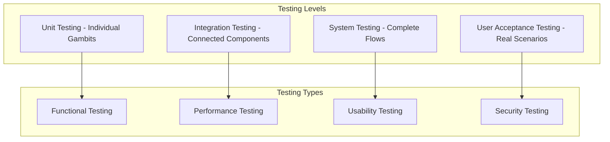

## The Critical Role of Testing

Testing your AI agent before deployment is not optional—it's essential for delivering reliable, effective conversational experiences. Unlike traditional software, AI agents interact with humans in unpredictable ways, making comprehensive testing crucial for success.

## Why Testing is Essential

### 🎯 User Experience Quality
**Conversation Flow Validation**:
- Ensure smooth progression through all conversation paths
- Verify that users can complete their intended tasks
- Identify confusing or frustrating interaction points
- Validate that responses feel natural and helpful

**Response Accuracy**:
- Confirm that the agent provides correct information
- Test knowledge base retrieval effectiveness
- Verify that AI responses align with business objectives
- Ensure consistency across different conversation scenarios

### 🔒 Risk Mitigation
**Business Risk Reduction**:
- Prevent customer frustration and negative experiences
- Avoid providing incorrect information or guidance
- Reduce the need for emergency fixes post-deployment
- Maintain brand reputation and customer trust

**Technical Risk Management**:
- Identify integration failures before they affect users
- Test error handling and edge case scenarios
- Validate security and data protection measures
- Ensure performance under various load conditions

### 📈 Performance Optimization
**Efficiency Improvements**:
- Optimize response times and user satisfaction
- Identify and fix bottlenecks in conversation flows
- Improve knowledge base search effectiveness
- Enhance overall agent performance metrics

## The Cost of Poor Testing

### Real-World Consequences

<Columns cols={2}>
  <Card title="Customer Impact" icon="users">
    **Negative Experiences:**
    - 67% of users abandon poorly performing chatbots
    - Bad first impressions are hard to overcome
    - Customer support tickets increase
    - Brand reputation damage
  </Card>
  <Card title="Business Impact" icon="trending-down">
    **Operational Costs:**
    - Emergency fixes cost 5x more than prevention
    - Lost sales and conversion opportunities
    - Increased support team workload
    - Delayed feature releases and improvements
  </Card>
</Columns>

### Common Issues Without Testing

**Conversation Failures**:
- Agents that can't understand common user inputs
- Conversation loops that trap users
- Missing error handling for edge cases
- Inappropriate or off-brand responses

**Integration Problems**:
- Failed connections to external systems
- Data synchronization issues
- Authentication and permission errors
- Performance degradation under load

**Knowledge Base Issues**:
- Outdated or incorrect information
- Poor search relevance and accuracy
- Missing content for common questions
- Conflicting information from multiple sources

## Testing Benefits

### Immediate Benefits

**Quality Assurance**:
- Catch and fix issues before users encounter them
- Validate that all features work as intended
- Ensure consistent behavior across scenarios
- Confirm integration reliability

**Performance Validation**:
- Verify response times meet expectations
- Test scalability under various loads
- Optimize resource usage and efficiency
- Identify performance bottlenecks

### Long-term Benefits

**User Satisfaction**:
- Higher completion rates for user tasks
- Improved user engagement and retention
- Positive feedback and reviews
- Reduced escalation to human agents

**Business Value**:
- Faster time to market for new features
- Reduced support costs and overhead
- Improved conversion rates and ROI
- Enhanced competitive advantage

## Testing Methodology Framework

### The Tars Testing Pyramid

### Testing Phases

**Phase 1: Component Testing**
- Individual gambit functionality
- Knowledge base search accuracy
- Integration connection validation
- Basic response quality

**Phase 2: Flow Testing**
- Complete conversation scenarios
- Multi-turn conversation handling
- Error recovery and fallback paths
- Cross-gambit data flow

**Phase 3: System Testing**
- End-to-end user journeys
- Performance under realistic conditions
- Multi-channel deployment validation
- Security and compliance verification

**Phase 4: User Acceptance Testing**
- Real user feedback and testing
- Business stakeholder validation
- Production-like environment testing
- Final optimization and refinement

## Testing Categories

### Functional Testing
**What it Tests**: Whether the agent does what it's supposed to do
- Conversation flow completion
- Knowledge base search accuracy
- Integration functionality
- Response appropriateness

### Performance Testing
**What it Tests**: How well the agent performs under various conditions
- Response time optimization
- Concurrent user handling
- Load stress testing
- Resource usage efficiency

### Usability Testing
**What it Tests**: How easy and pleasant the agent is to use
- User experience quality
- Conversation naturalness
- Task completion ease
- Accessibility compliance

### Security Testing
**What it Tests**: Whether the agent protects user data and business assets
- Data protection validation
- Access control verification
- Input sanitization testing
- Integration security validation

## Testing Best Practices

### Early and Continuous Testing

**Test-Driven Development**:
- Define success criteria before building
- Create test scenarios alongside development
- Automate repetitive testing tasks
- Integrate testing into development workflow

**Iterative Improvement**:
- Test frequently throughout development
- Address issues as soon as they're discovered
- Use feedback to guide development priorities
- Maintain testing documentation and results

### Comprehensive Coverage

**Scenario Planning**:
- Test happy path scenarios
- Include edge cases and error conditions
- Validate all conversation branches
- Test integration points thoroughly

**Real-World Simulation**:
- Use realistic user data and scenarios
- Test with actual business processes
- Include representative user personas
- Simulate production-like conditions

### Collaborative Testing

**Cross-Functional Teams**:
- Include business stakeholders in testing
- Get feedback from actual end users
- Involve technical and non-technical team members
- Document and share testing insights

## Measuring Testing Success

### Key Metrics

<Columns cols={2}>
  <Card title="Quality Metrics" icon="gauge">
    **Response Accuracy**: 90%+ correct responses
    **Task Completion**: 85%+ successful user journeys
    **Error Rate**: < 5% conversation failures
    **User Satisfaction**: 4.5+ rating (1-5 scale)
  </Card>
  <Card title="Performance Metrics" icon="speedometer">
    **Response Time**: < 200ms average
    **Availability**: 99.9%+ uptime
    **Scalability**: Handle 10x normal load
    **Resource Efficiency**: Optimized costs
  </Card>
</Columns>

### Success Indicators

**Technical Success**:
- All test cases pass consistently
- Performance meets or exceeds requirements
- Integration reliability is validated
- Security standards are met

**Business Success**:
- Stakeholder approval and sign-off
- User acceptance test completion
- Deployment readiness confirmation
- Success metrics baseline established

## Getting Started with Testing

Ready to implement comprehensive testing? Start here:

<CardGroup cols={2}>
  <Card title="Testing Methodologies" icon="clipboard-list" href="/test/testing-fundamentals/testing-methodologies">
    Learn different approaches to testing AI agents effectively
  </Card>
  <Card title="Preview Testing" icon="eye" href="/test/preview-testing/real-time-preview">
    Start with real-time testing in the Tars preview environment
  </Card>
  <Card title="Best Practices" icon="star" href="/test/testing-fundamentals/testing-best-practices">
    Follow proven guidelines for comprehensive agent testing
  </Card>
  <Card title="Performance Testing" icon="speedometer" href="/test/performance-testing/response-time-testing">
    Ensure your agent performs well under various conditions
  </Card>
</CardGroup>

<Note>
  **Testing Mindset**: Think of testing as an investment, not a cost. Thorough testing pays dividends in user satisfaction, reduced support costs, and faster feature development cycles.
</Note>
