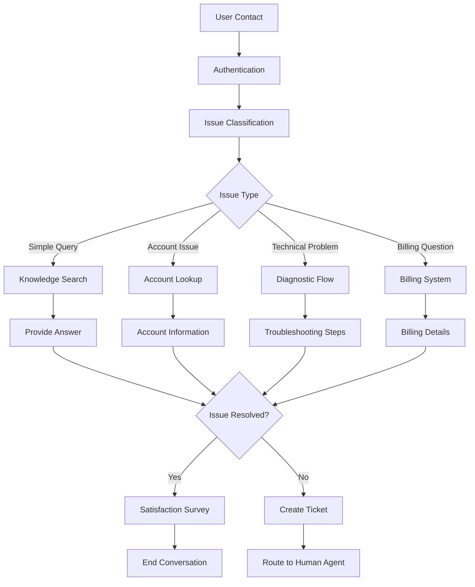

## Helpdesk Automation Overview

Transform your customer support operations with AI Agents that handle routine inquiries, route complex issues, and provide 24/7 assistance. Helpdesk automation reduces support costs while improving customer satisfaction through instant, accurate responses.

## Common Support Scenarios

### 🎫 Ticket Creation & Routing

**Automated Ticket Management**:

- Intelligent category assignment based on issue description
- Priority scoring using urgency and impact analysis
- Automatic routing to appropriate support teams
- Integration with existing ticketing systems (Zendesk, Freshdesk, ServiceNow)

**Example Implementation**:

```
User: "My software keeps crashing when I try to export reports"
Agent: I understand you're experiencing crashes during report exports. Let me gather some details and create a priority ticket for our technical team.

1. What software version are you using?
2. What type of reports are you trying to export?
3. When did this issue first occur?

[Agent creates ticket automatically with gathered information]
```

### 🔍 Common Troubleshooting

**Self-Service Resolution**:

- Step-by-step troubleshooting guides
- Interactive diagnostic workflows
- Video and screenshot integration
- Success confirmation and feedback collection

**Knowledge Base Integration**:

- Semantic search across support documentation
- Real-time content updates
- Multi-language support
- Source attribution for transparency

### 📊 Account & Billing Inquiries

**Instant Information Access**:

- Account status and subscription details
- Billing history and payment information
- Usage analytics and quota tracking
- Automated renewal and upgrade guidance

**Secure Data Handling**:

- Multi-factor authentication verification
- Encrypted data transmission
- Privacy-compliant information sharing
- Audit trails for compliance

## Implementation Strategy

### Phase 1: Foundation Setup

**Knowledge Base Preparation**:

1. **Content Audit**: Review existing support documentation
2. **FAQ Compilation**: Identify most common support questions
3. **Process Documentation**: Map current support workflows
4. **Integration Planning**: Design connections with existing tools

**Agent Configuration**:

- Personality aligned with brand voice
- Escalation triggers and thresholds
- Response templates and variations
- Multi-language support setup

### Phase 2: Core Functionality

**Basic Support Automation**:

- Account lookup and verification
- Common troubleshooting flows
- Ticket creation and tracking
- Knowledge base search and retrieval

**Integration Development**:

- CRM system connections
- Ticketing platform integration
- Knowledge management system links
- Analytics and reporting setup

### Phase 3: Advanced Features

**Intelligent Routing**:

- Machine learning-based categorization
- Sentiment analysis for priority scoring
- Skill-based Agent assignment
- Predictive issue identification

**Proactive Support**:

- Outage and maintenance notifications
- Preventive maintenance reminders
- Usage pattern analysis and recommendations
- Customer health score monitoring

## Architecture Example

### Support Agent Flow Design



### Key Components

<Columns cols={2}>
  <Card title="Authentication Gambit" icon="shield-check">
    **Security First** - Multi-factor verification - Account validation -
    Privacy compliance - Session management
  </Card>
  <Card title="Classification Engine" icon="tags">
    **Intelligent Routing** - Intent recognition - Category assignment -
    Priority scoring - Team routing logic
  </Card>
  <Card title="Knowledge Integration" icon="database">
    **Information Access** - Semantic search - Real-time updates - Multi-source
    aggregation - Relevance ranking
  </Card>
  <Card title="Escalation Logic" icon="arrow-up">
    **Human Handoff** - Complexity detection - Sentiment monitoring -
    Skill-based routing - Context preservation
  </Card>
</Columns>

## Real-World Example: TechCorp Support

### The Challenge

TechCorp's support team was overwhelmed with 500+ daily tickets, 70% of which were routine inquiries about account access, billing, and basic troubleshooting.

### The Solution

Implemented a comprehensive helpdesk automation Agent with:

**Core Features**:

- Account verification and password reset
- Billing inquiry automation
- First-level technical troubleshooting
- Intelligent ticket creation and routing

**Integration Points**:

- Salesforce CRM for customer data
- Zendesk for ticket management
- Confluence for Knowledge Base
- Slack for internal notifications

### The Results

<Columns cols={2}>
  <Card title="Operational Efficiency" icon="gauge">
    **60% Reduction** in ticket volume **80% Faster** initial response time
    **24/7 Availability** without staffing costs **45% Improvement** in
    resolution time
  </Card>
  <Card title="Customer Satisfaction" icon="heart">
    **4.8/5** customer satisfaction score **90% Resolution** rate for automated
    interactions **35% Increase** in self-service usage **50% Reduction** in
    escalations
  </Card>
</Columns>

### Customer Testimonial

_"The AI support Agent has transformed our customer experience. Customers get instant help for common issues, and our human agents can focus on complex problems that really need their expertise. It's a win-win for everyone."_ - Sarah Chen, Head of Customer Success

## Implementation Checklist

### Pre-Launch Requirements

**Content Preparation**:

- [ ] Comprehensive FAQ database
- [ ] Troubleshooting documentation
- [ ] Process flow documentation
- [ ] Brand voice guidelines

**Technical Setup**:

- [ ] CRM integration testing
- [ ] Ticketing system connection
- [ ] Knowledge base synchronization
- [ ] Security and compliance validation

**Team Preparation**:

- [ ] Staff training on new workflows
- [ ] Escalation procedures documentation
- [ ] Performance metrics establishment
- [ ] Feedback collection process

### Success Metrics

**Efficiency Metrics**:

- Ticket volume reduction percentage
- Average response time improvement
- First contact resolution rate
- Agent productivity increase

**Quality Metrics**:

- Customer satisfaction scores
- Resolution accuracy rate
- Escalation rate changes
- User adoption and engagement

## Best Practices

### Conversation Design

**Natural Interaction Patterns**:

- Use conversational language, not formal support speak
- Ask clarifying questions to understand the issue
- Provide clear next steps and expectations
- Confirm understanding before taking action

**Error Handling**:

- Graceful handling of unclear requests
- Multiple ways to express the same issue
- Clear escalation paths when needed
- Transparent communication about limitations

### Knowledge Management

**Content Strategy**:

- Regular review and updates of support content
- User feedback integration for content improvement
- Performance analytics to identify knowledge gaps
- Multi-format content support (text, images, videos)

**Search Optimization**:

- Use natural language variations for the same concepts
- Include common misspellings and alternative terms
- Organize content with clear categories and tags
- Test search effectiveness regularly

## Advanced Features

### Predictive Support

**Proactive Assistance**:

- Identify potential issues before they become problems
- Send preventive maintenance reminders
- Alert customers about relevant updates or changes
- Provide usage optimization recommendations

**Pattern Recognition**:

- Analyze common issue patterns
- Predict busy periods and resource needs
- Identify trending problems for Knowledge Base updates
- Suggest process improvements based on data

### Multi-Channel Integration

**Omnichannel Support**:

- Consistent experience across web, mobile, and messaging
- Context preservation across channel switches
- Unified customer view and interaction history
- Coordinated human Agent handoffs

## Getting Started

Ready to implement helpdesk automation? Follow these steps:

<CardGroup cols={2}>
  <Card
    title="Planning Worksheet"
    icon="clipboard-list"
    href="/use-case-examples/customer-support/faq-chatbots"
  >
    Start with FAQ automation to build foundation knowledge
  </Card>
  <Card
    title="Integration Guide"
    icon="link"
    href="/tools-integration/individual-tools/hubspot/configuration-guide"
  >
    Connect your CRM and support tools for seamless workflows
  </Card>
  <Card
    title="Escalation Setup"
    icon="arrow-up"
    href="/use-case-examples/customer-support/escalation-workflows"
  >
    Design smooth handoffs to human agents when needed
  </Card>
  <Card
    title="Analytics Setup"
    icon="chart-line"
    href="/analyze/analytics-fundamentals/key-metrics-overview"
  >
    Track performance and optimize your support automation
  </Card>
</CardGroup>

<Note>
  **Start Small**: Begin with automating the most common, straightforward
  support inquiries. As you gain confidence and data, gradually expand to more
  complex scenarios.
</Note>
