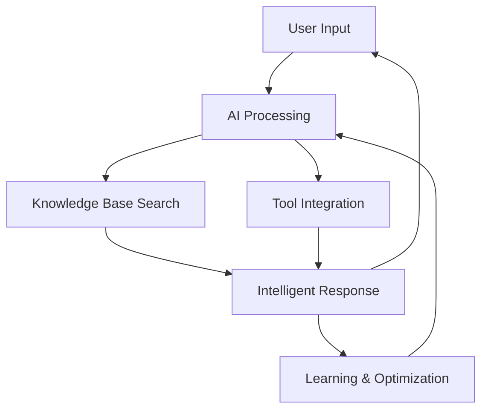

## Platform Overview

Tars is a comprehensive AI agent platform that enables businesses to create intelligent conversational experiences that go far beyond traditional chatbots. Our platform combines advanced language models, knowledge processing, and seamless integrations to deliver human-like interactions that drive real business results.

## Key Capabilities

### 🧠 Intelligent AI Agents
Unlike rule-based chatbots that follow scripted responses, Tars agents:
- Understand context and maintain conversation history
- Learn from interactions to improve over time
- Handle complex, multi-turn conversations naturally
- Adapt their responses based on user intent and behavior

### 📚 Knowledge-Powered Responses
Tars agents access and utilize your business knowledge through:
- **Semantic Search**: Find relevant information from your content
- **Vector Embeddings**: Understand meaning, not just keywords
- **Real-time Learning**: Continuously improve response accuracy
- **Multi-source Integration**: Combine data from websites, documents, and databases

### 🔗 Seamless Integrations
Connect with your existing business tools:
- **CRM Systems**: HubSpot, Salesforce, Pipedrive
- **Productivity Tools**: Google Sheets, Airtable, Notion
- **Communication Platforms**: Slack, Microsoft Teams
- **E-commerce**: Shopify, WooCommerce, Stripe
- **50+ Pre-built Connectors** with custom API support

### 🌐 Multi-Platform Deployment
Deploy your agents across multiple channels:
- **Website Integration**: Embed on any website with customizable widgets
- **WhatsApp Business**: Reach customers on their preferred messaging platform
- **Direct Links**: Share standalone agent experiences
- **Custom Domains**: Host on your own branded domains

## How Tars Works

### The Tars Advantage

<Columns cols={2}>
  <Card title="Traditional Chatbots" icon="robot">
    - Rule-based responses
    - Limited conversation flow
    - Static knowledge base
    - Manual maintenance required
    - Basic keyword matching
  </Card>
  <Card title="Tars AI Agents" icon="brain">
    - Context-aware conversations
    - Dynamic conversation management
    - Self-updating knowledge
    - Continuous learning
    - Semantic understanding
  </Card>
</Columns>

## Business Impact

### For Customer Support
- **75% reduction** in response time
- **60% increase** in customer satisfaction
- **24/7 availability** without human intervention
- **Automatic ticket routing** for complex issues

### For Lead Generation
- **3x higher** qualification rates
- **50% more** qualified leads captured
- **Instant engagement** with website visitors
- **Seamless handoff** to sales teams

### For E-commerce
- **40% increase** in conversion rates
- **Personalized recommendations** based on user behavior
- **Abandoned cart recovery** with intelligent follow-up
- **Order tracking** and support automation

## Getting Started

Ready to transform your customer interactions? Choose your path:

<CardGroup cols={2}>
  <Card title="Quick Start" icon="rocket" href="/quickstart">
    Build your first agent in 15 minutes with our guided tutorial.
  </Card>
  <Card title="Platform Fundamentals" icon="foundation" href="/platform-fundamentals/how-tars-works">
    Understand the core concepts and architecture first.
  </Card>
  <Card title="Use Case Examples" icon="lightbulb" href="/use-case-examples/customer-support/helpdesk-automation">
    Explore real-world implementations and best practices.
  </Card>
  <Card title="API Documentation" icon="code" href="/api-reference/introduction">
    Integrate Tars with your existing systems and workflows.
  </Card>
</CardGroup>

<Note>
  **New to AI agents?** Start with our [Platform Fundamentals](/platform-fundamentals/how-tars-works) to understand key concepts before building your first agent.
</Note>
